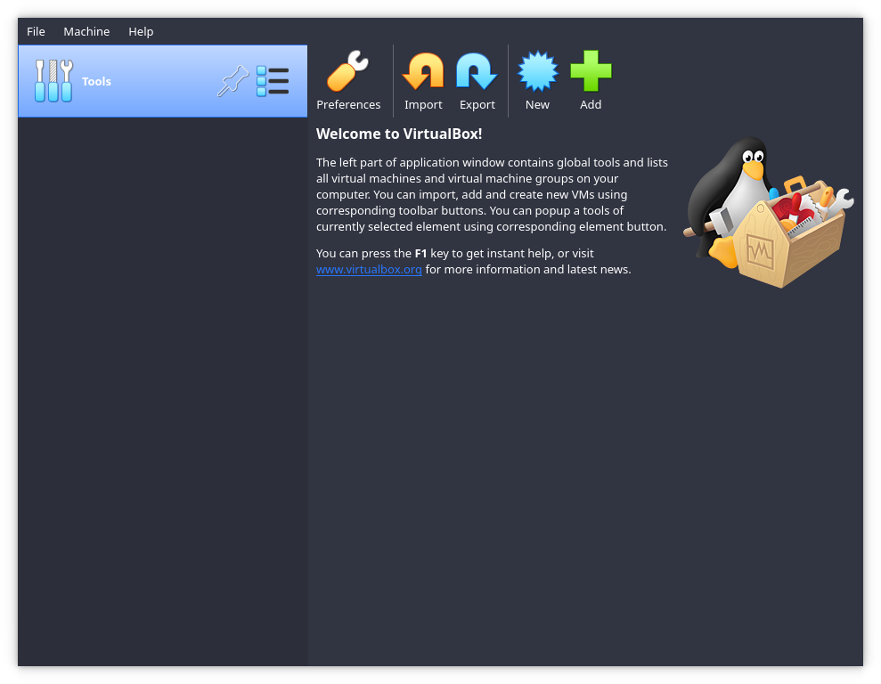
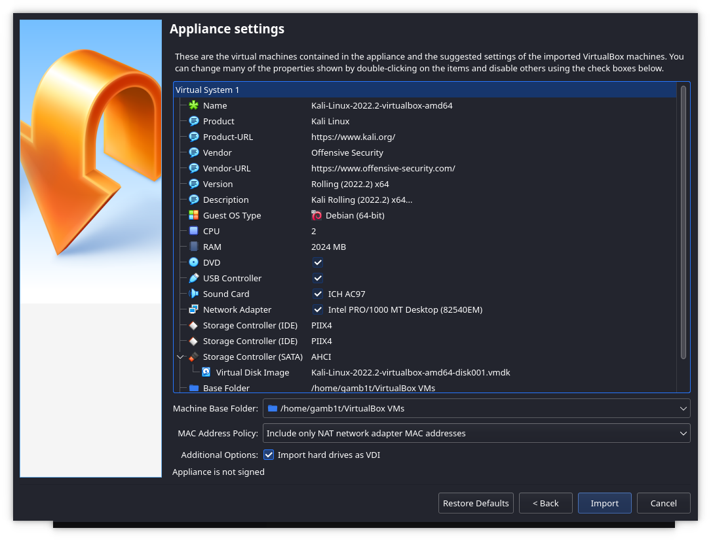
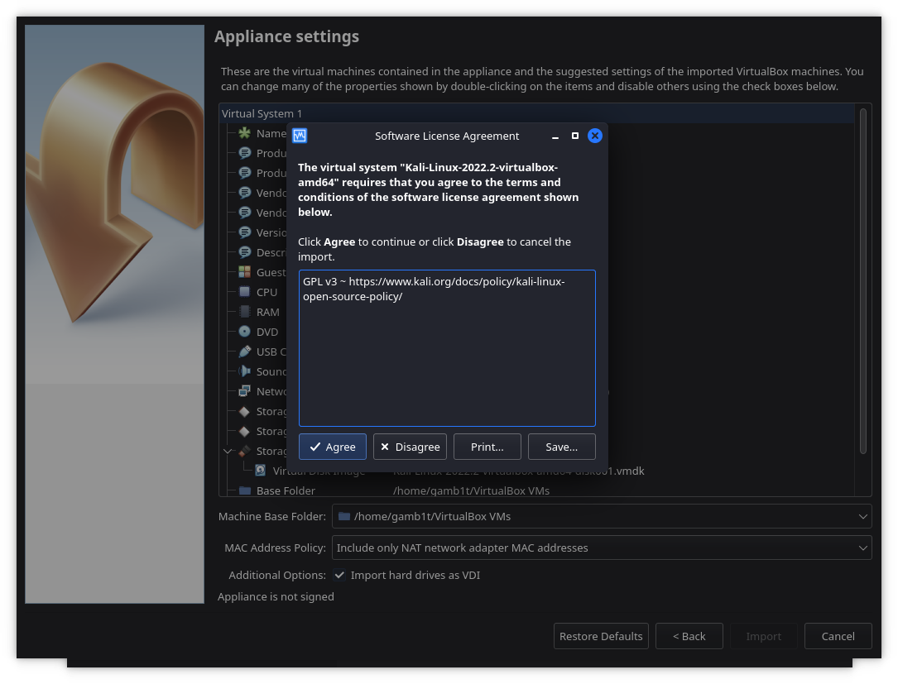

**This page is dated**. You can find the **latest version** here: [Install Pre-Made Kali VirtualBox VM](/docs/virtualization/import-premade-virtualbox/).

- - -

Importing the [Kali VirtualBox image](/get-kali/#kali-virtual-machines) is a four step after we have it downloaded.

We first launch VirtualBox:

From here we will be wanting to select 'Import':

We select the file we downloaded earlier and then we are able to continue forward:

We can verify the settings that will be set here, and if we need to change any we can. Once we are happy we can select 'Import':

We now just need to agree to the license agreement, and then we are all done. From here we can boot the VM and use it as normal. Remember the default login is kali for the user and kali for the password!
