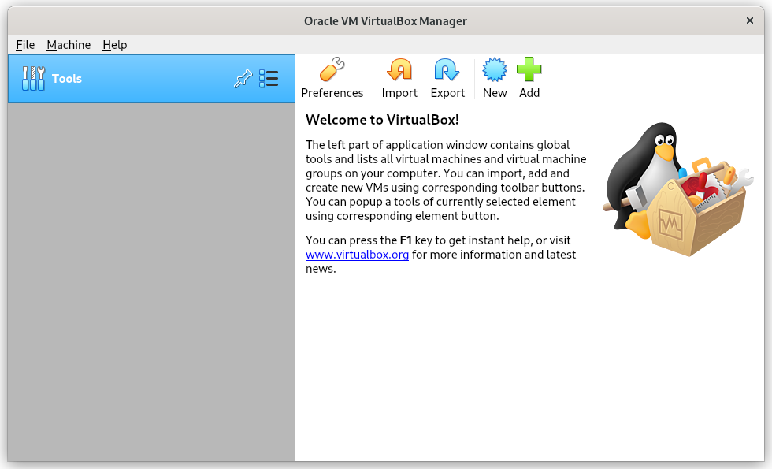
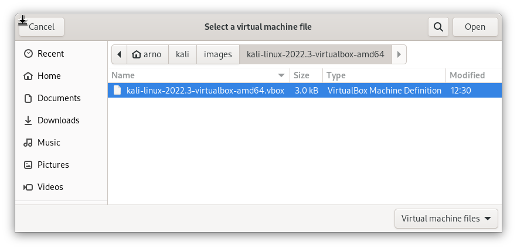
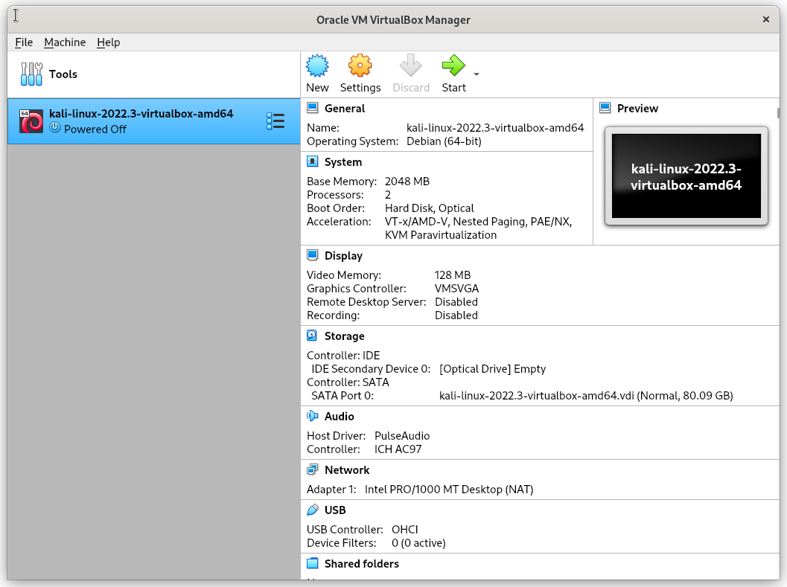

Importing the [Kali VirtualBox image](/get-kali/#kali-virtual-machines) is very easy.

We first need to extract the VirtualBox image:

```console
kali@kali:~$ 7z x kali-linux-2024.1-virtualbox-amd64.7z
[...]
kali@kali:~$
```

If we are using Windows we can instead use the [official 7z app](https://www.7-zip.org/).

We then launch VirtualBox:



From here we will be wanting to select 'Add'. We then navigate to the location our VM is downloaded and find the `.vbox` file:



We select this then we are able to continue forward:



We can verify the settings that will be set here, and if we need to change any we can. Once we are happy we can select boot the VM and use it as normal. Remember the default login is kali for the user and kali for the password!
