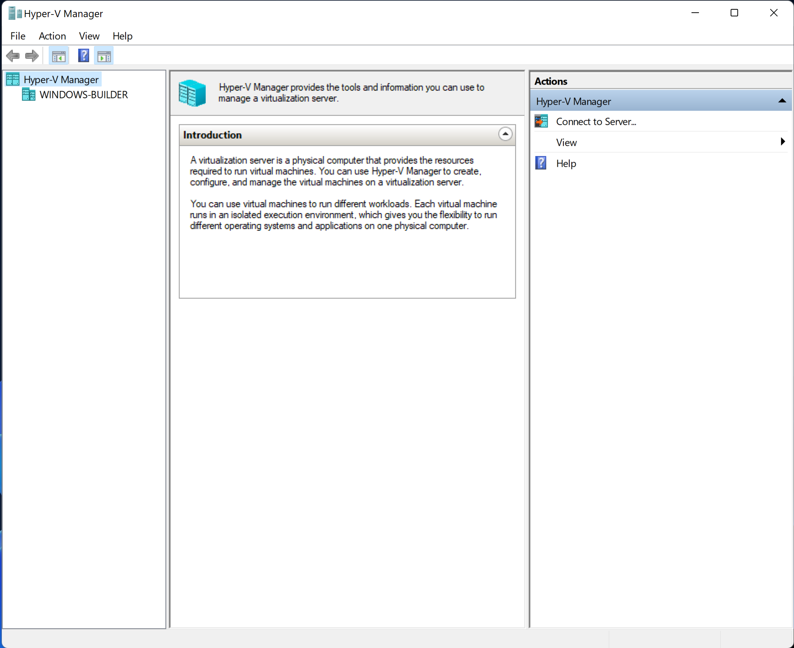
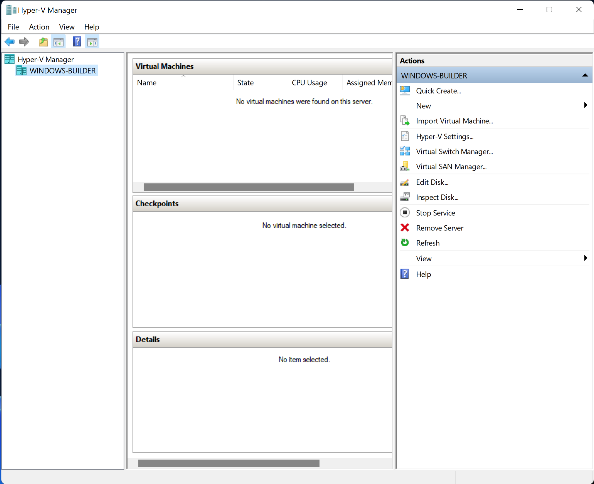
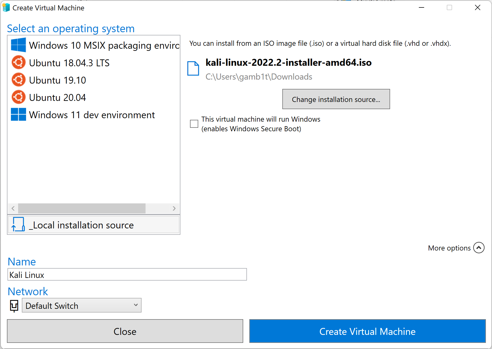
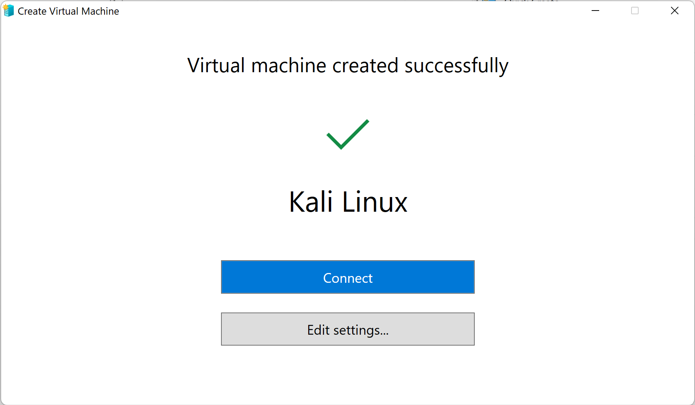
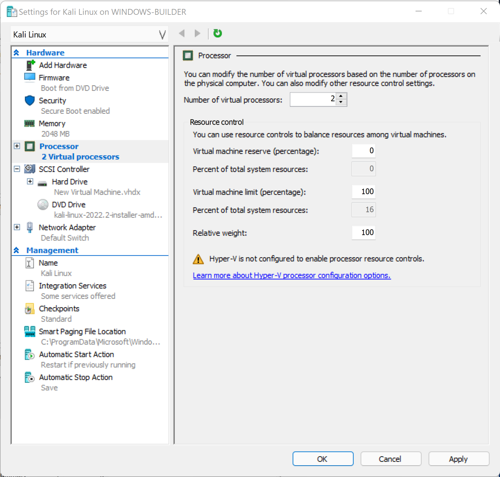

For most Windows users Hyper-V is already enabled. However, in case it isn't enabled on your system you can follow one of the following docs pages from Microsoft:

- For [Windows 8, 8.1](https://docs.microsoft.com/en-us/previous-versions/windows/it-pro/windows-server-2012-R2-and-2012/hh846766(v=ws.11))
- For [Windows 10, 11](https://docs.microsoft.com/en-us/virtualization/hyper-v-on-windows/quick-start/enable-hyper-v)

After we enable Hyper-V we can create a new VM very easily. We first need to [download](/get-kali/) an installer iso. Then we can boot Hyper-V:

We will need to select our computer on the left-hand side under 'Hyper-V Manager':

We can then select 'Quick Create...' on the right-hand side:

We will have to configure some things on this screen. We first be sure to have selected 'Local installation source' and then select our iso after selecting 'Change installation source...'. After this we can de-select the option 'This machine will run Windows' and can also use the drop-down 'More options' menu to name our virtual machine.

Once we are happy we can select 'Create Virtual Machine' and wait for it to finish. We will then see this screen:

From here we can either select 'Connect' if we are confident in Windows's selections for options, or we can select 'Edit Settings...':

In the case of this machine, the only change needed was for the number of virtual processors. We dropped it down from 6 to 2. We are then ready to connect to our VM and continue [setup like normal](/docs/installation/hard-disk-install/)
