This guide is about virtualizing Kali Linux inside of Parallels, allowing you to have a Kali VM. This is a great way to use Kali, as it is completely separate from the host, allows you to interact with other VMs (as well as the host, and other machines on the network), and allows you to revert to snapshots.

### Wizard

Upon starting up Parallels, select the **Plus** symbol.

- - -

This will launch the **Installation Assistant**

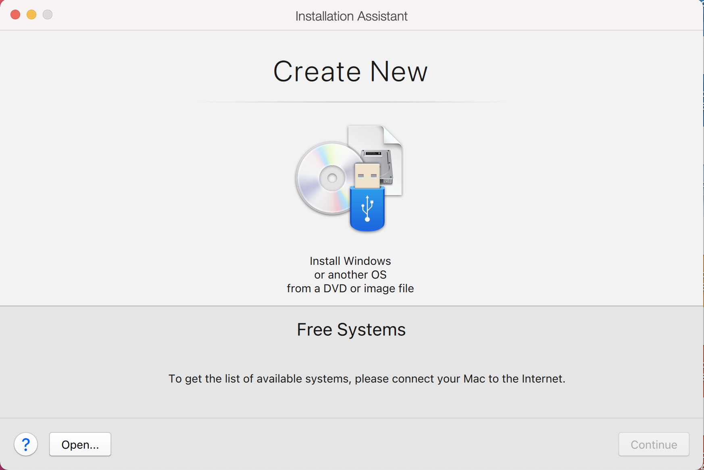

- - -

Now we choose **Install Windows or another OS from a DVD or image file**

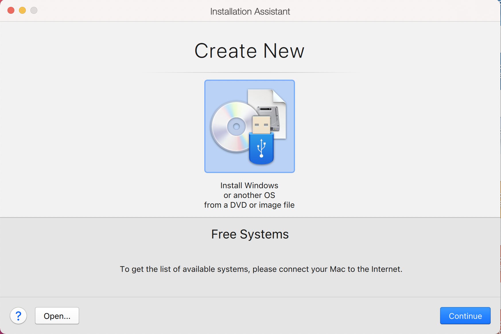

- - -

On this screen, we select the Kali Linux image to use to install from. We select "**Choose Manually**", and navigate to the location of the ISO that we [downloaded](/docs/introduction/download-official-kali-linux-images/). For more information on [what image to download, we have written up a guide](/docs/introduction/what-image-to-download/).

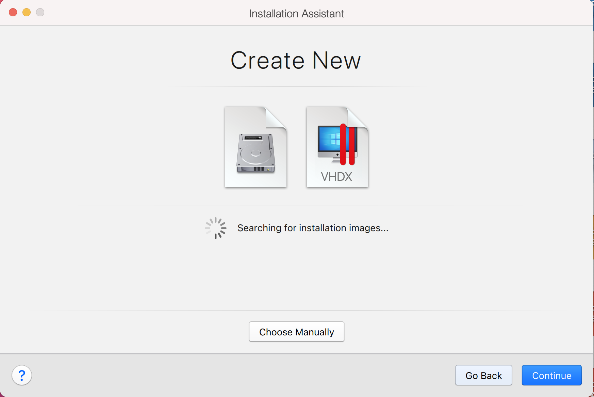

- - -

Either drag the ISO file or choose **Select a file...** to navigate to the downloaded ISO.

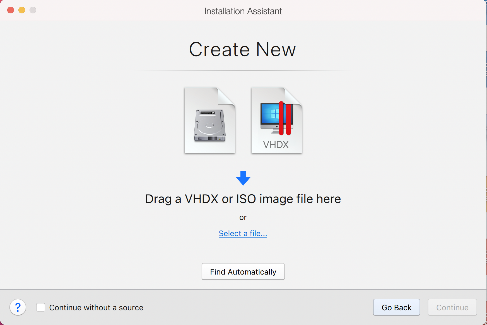
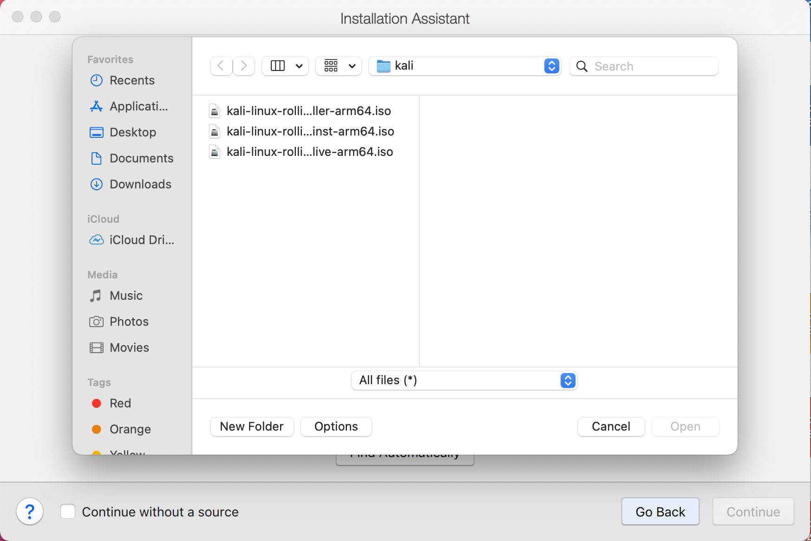
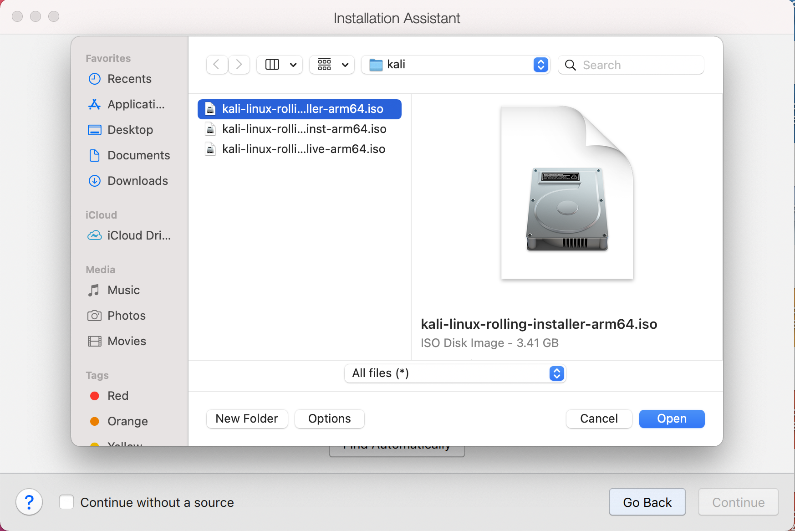

- - -

Parallels does not recognize the OS on the ISO, so we will choose **Continue** to proceed anyway.

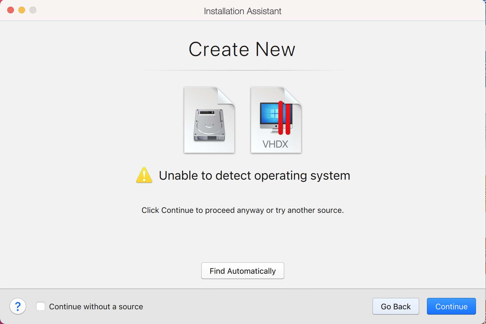 

- - -

Once we have clicked **Continue**, we want to choose **Ubuntu** from the drop down list. Normally we would choose **Debian** however, there is a bug with the Parallels Tools, that does not occur when using **Ubuntu**.

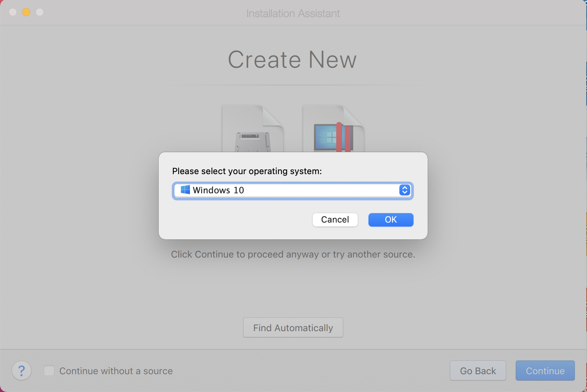

- - -

The next screen is "Name and Location", which is where you name the VM. This name is also used as the filename (such as the configuration, hard disk and snapshot - which is not changed from this point).

We also want to mark the check box for **Customize settings before installation**

We are keeping it generic in this guide, by using "**Kali Linux**" (as Kali Linux is a [rolling distribution](/docs/general-use/kali-branches/), and we [update Kali Linux](/docs/general-use/updating-kali/)).

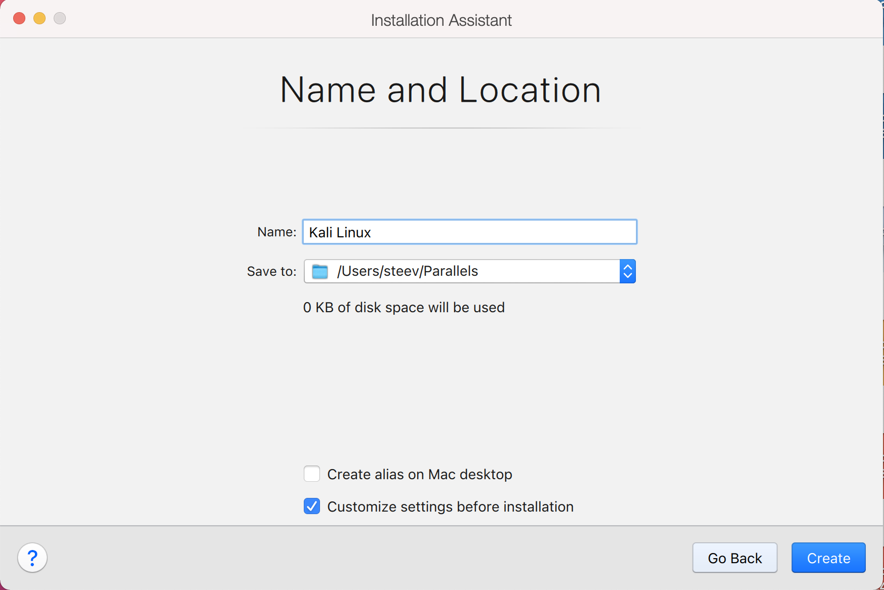

- - -

This will bring up the Configuration screen for the Virtual Machine.

The next screen is "Processors". Here we can start to define how many resources we give the VM. Kali will be able to perform more tasks simultaneously and quicker if it is allocated more resources. We select "**2 processors**" and "** 2048 MB ** ", giving a total of 2 cores and 2GB of RAM. You may wish to use more or less depending on your system requirements.

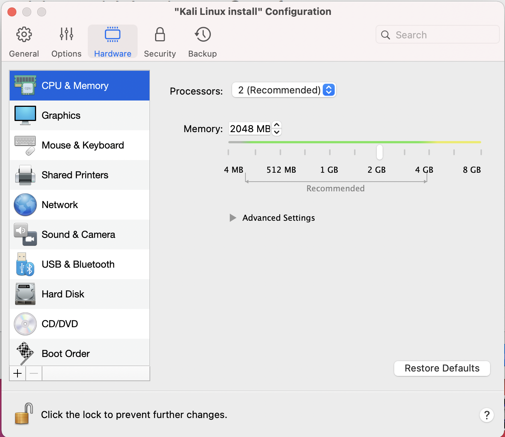

- - -

Now we want to choose **Hard Disk** so we can resize the hard disk.

Select the **Properties** button

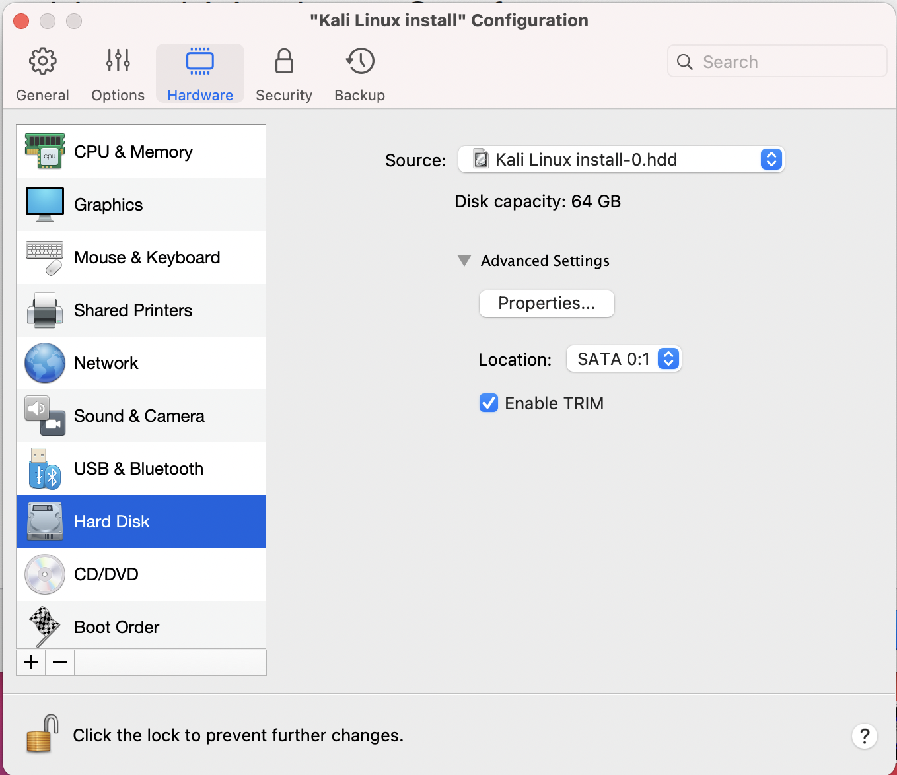

And reduce the size to 32GB. You may wish to leave it at 64GB, or increase it, depending on your system requirements.

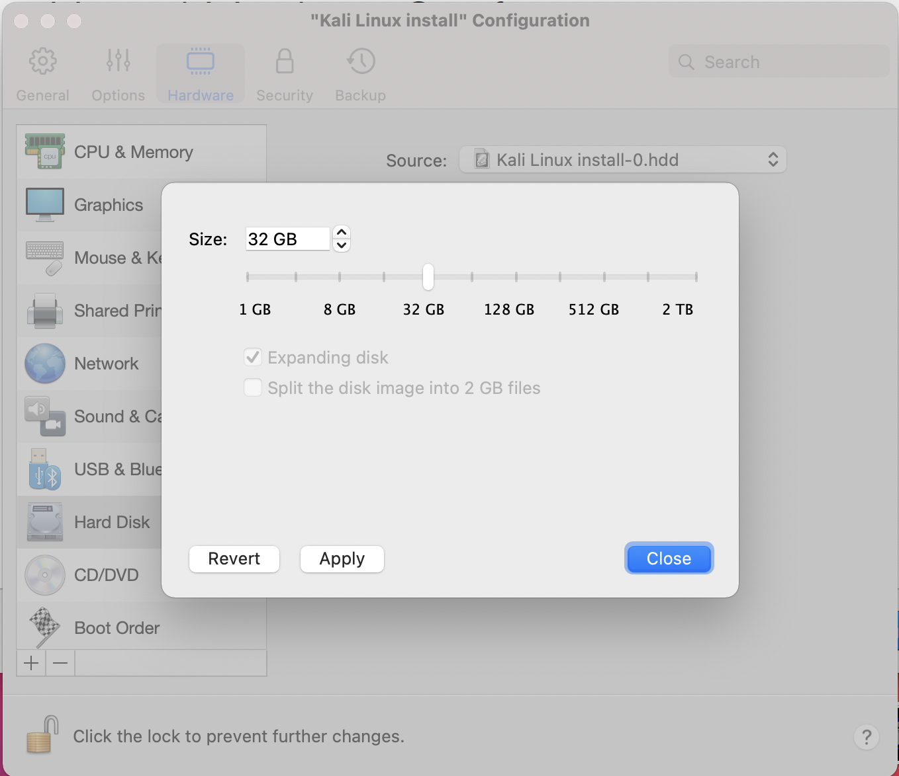

Click **Apply** and you will be prompted to **Continue**

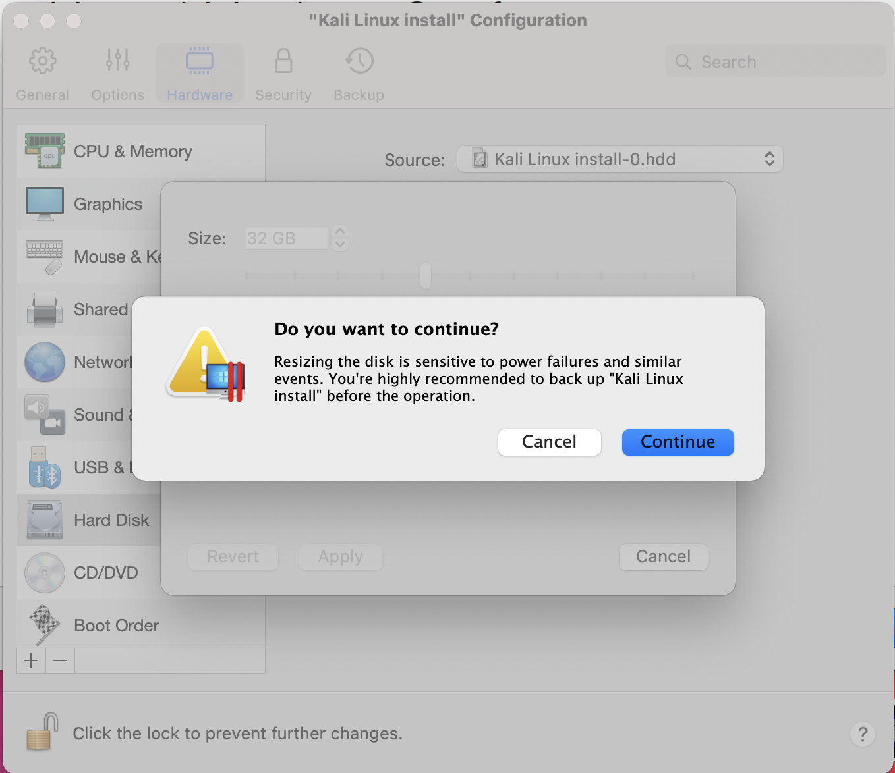

Click **Continue**

- - -

We can now close the **Kali Linux Configuration** window, and be back at the **Installation Assistant** screen.

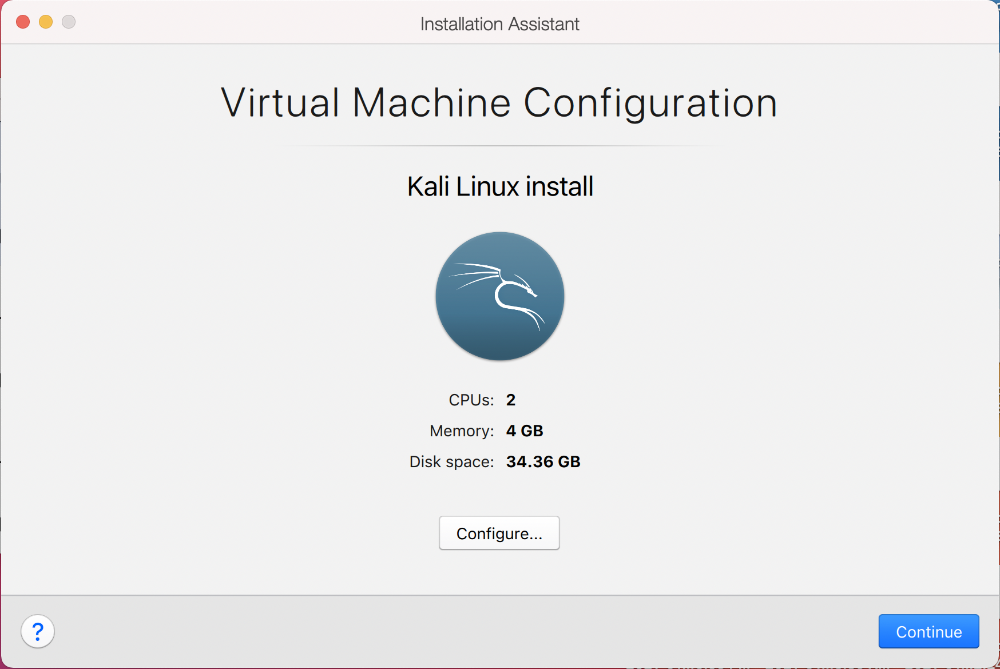

- - -

After all this is done, we save, start up the VM, and then continue installing Kali Linux as we normally would for a [bare metal install](/docs/installation/hard-disk-install/).
