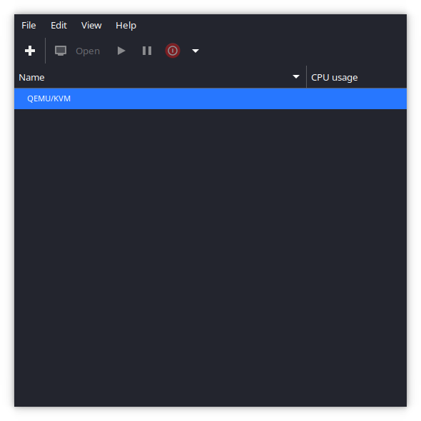
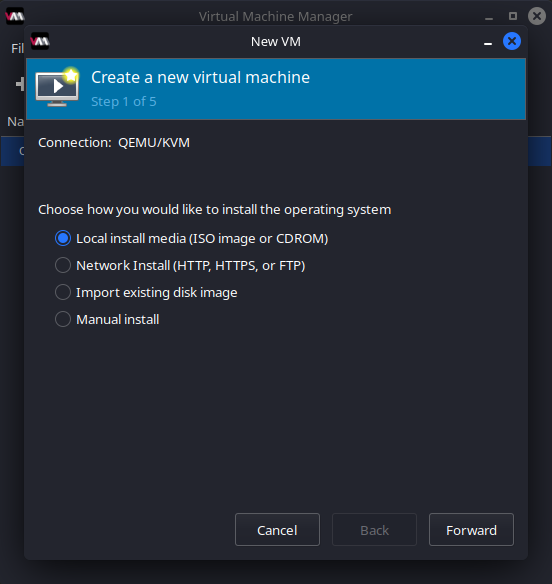
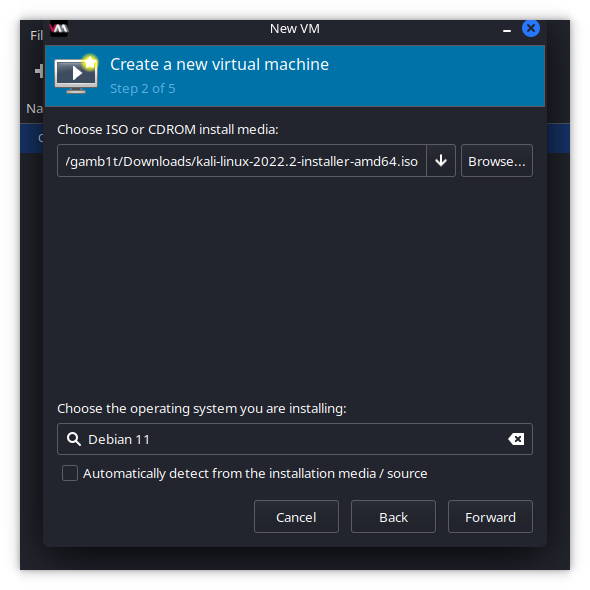
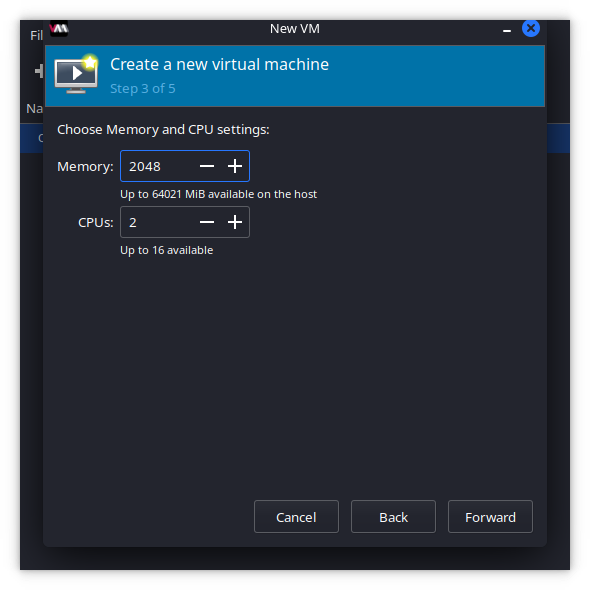
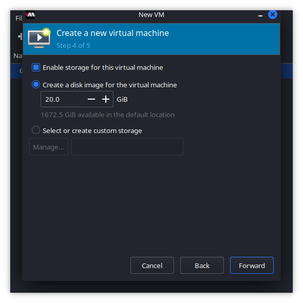
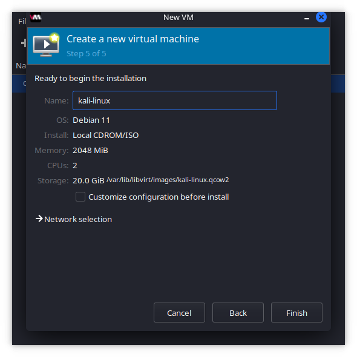

We understand there are a lot of options for interfacing with KVM and QEMU to create different VMs, however for the purposes of this guide we will be using the most common option.

To get a Debian based system prepared for this, we can simply run the following command:

```console
kali@kali:~$ sudo apt update && sudo apt install virt-manager -y
[...]
```

This will pull in all of the necessary packages and will allow us to create our VM just fine.

After [`virt-manager`](https://manpages.debian.org/bullseye/virt-manager/virt-manager.1.en.html) is installed, we can launch it and put in our password as we need elevated permissions for some tasks.

From here we can select the "+" and begin to create our VM:



We want to ensure we select local ISO file:



We choose our ISO and also de-select guessing the OS and input "Debian 11":



We make sure to use 2GB of memory and 2 CPU cores:



We set our system to be 20GB:



We can now finalize setup by changing the system name to "kali-linux":



From here we can follow the normal [Kali Linux installation](/docs/installation/hard-disk-install/)
