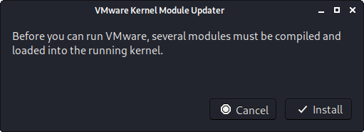
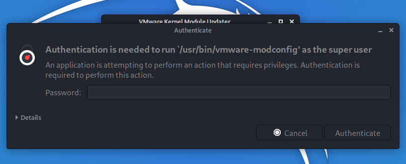
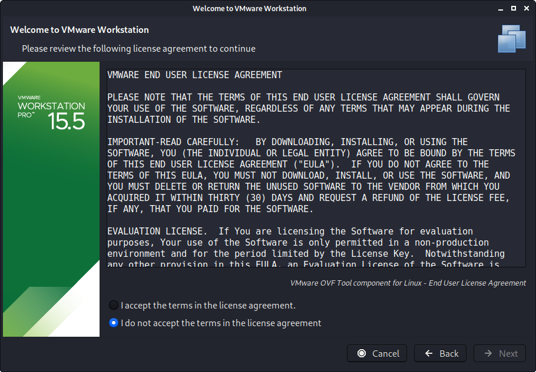
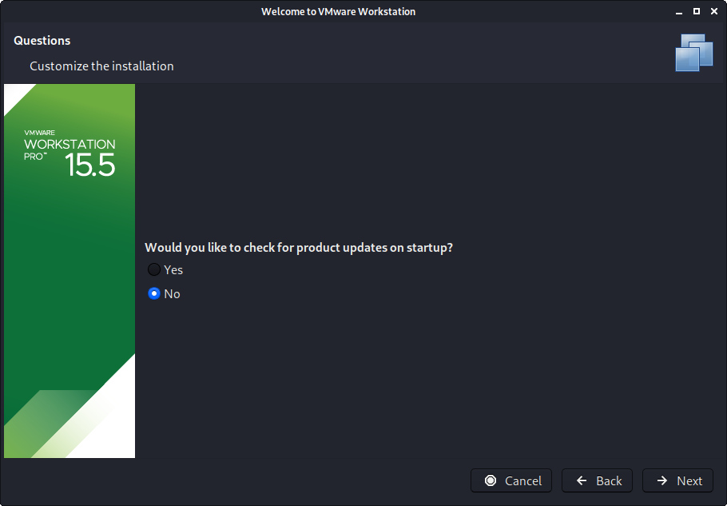
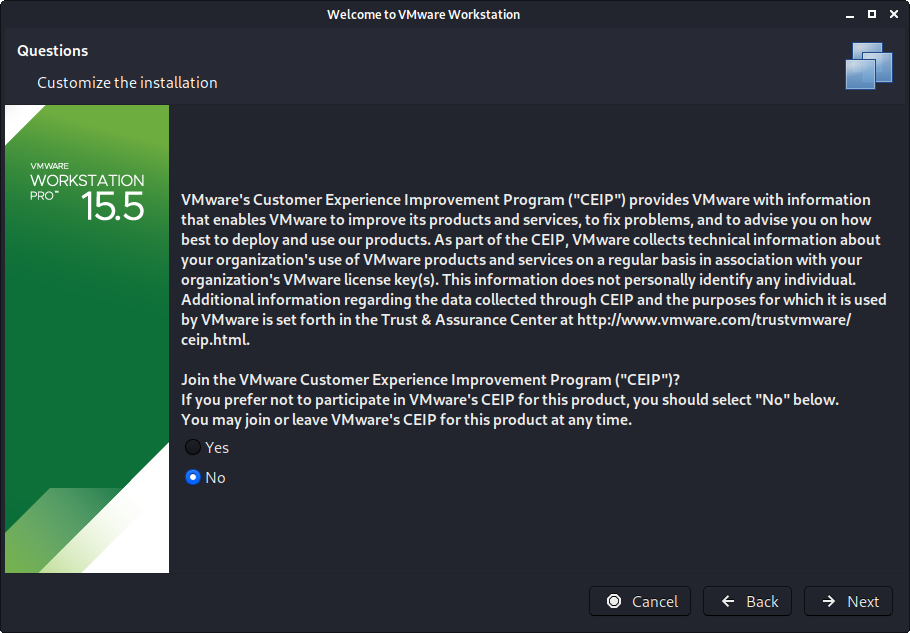
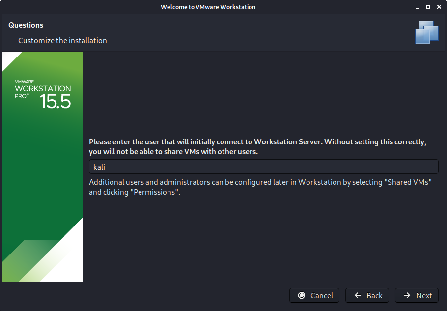
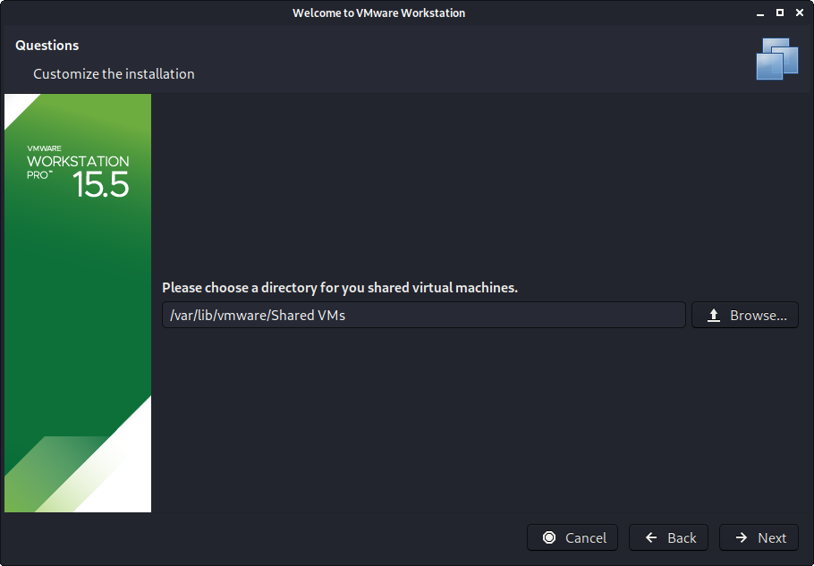
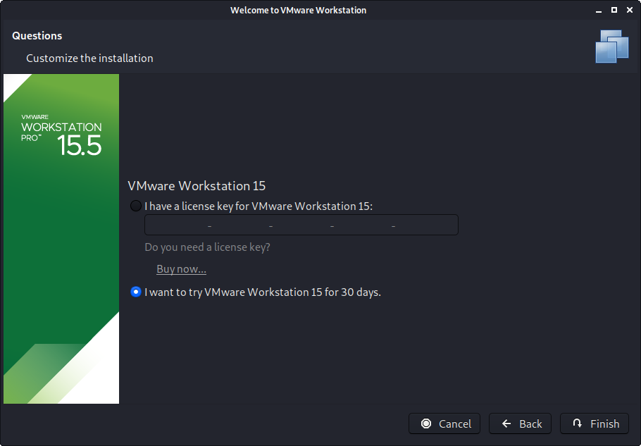
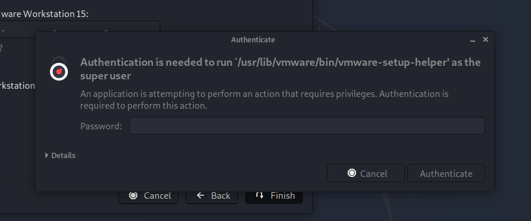
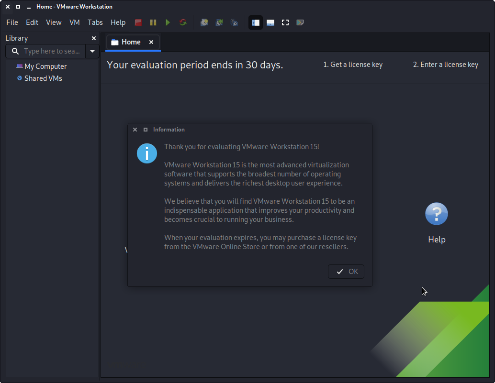

You can install VMware workstation or player **on** Kali Linux, allowing you to use Virtual Machines (VMs) inside of Kali Linux. However if you wish to use Kali Linux **as** a virtual machine, you will want our [Kali Linux Guest VMware](/docs/virtualization/install-vmware-guest-vm/) guide.

VMs are great, as there are many reasons why to use them. One of the being, able to run multiple Operating Systems at the same time. You can have your host machine "untouched", and then only interact with the guest VMs. Another is when something is going right, take a snapshot. When something goes wrong, revert back.

VMware Workstation & Fusion is a commercial software (there is VMware Player which is free but it is limited in features). There are various free or open source solution (such as [VirtualBox](/docs/virtualization/install-virtualbox-host/), QEMU, KVM/Xen with virt-manager).

---

### Preparation

Before trying to install VMware, please make sure your version of Kali Linux is [up-to-date](/docs/general-use/updating-kali/), and if required, reboot the machine:

```console
kali@kali:~$ sudo apt update
[...]
kali@kali:~$
kali@kali:~$ sudo apt full-upgrade -y
[...]
kali@kali:~$
kali@kali:~$ [ -f /var/run/reboot-required ] && sudo reboot -f
kali@kali:~$
```

---

### Download

To start with, you will need to download VMware. You can do this by going to [VMware's download page](https://www.vmware.com/uk/products/workstation-pro/). At the time of writing, the latest version is `15.5.1-15018445`.

Alternatively, you can do the following command line method:

```console
kali@kali:~$ sudo apt install -y curl
[...]
kali@kali:~$
kali@kali:~$ curl -A "Mozilla/5.0 (X11; Linux x86_64; rv:109.0) Gecko/20100101 Firefox/115.0" \
  -o Downloads/vmware.bundle \
  -L https://www.vmware.com/go/getworkstation-linux
kali@kali:~$
kali@kali:~$ file Downloads/vmware.bundle
Downloads/vmware.bundle: a bash script executable (binary data)
kali@kali:~$
kali@kali:~$ ls -lah Downloads/vmware.bundle 
-rw-r--r-- 1 kali kali 514M Oct  3 02:13 Downloads/vmware.bundle
kali@kali:~$
```

When everything is up-to-date, and ready to go, make sure the file is executable and then call it:

```console
kali@kali:~$ chmod +x ~/Downloads/vmware.bundle
kali@kali:~$
kali@kali:~$ sudo ~/Downloads/vmware.bundle
Extracting VMware Installer...done.
Installing VMware Workstation 17.0.2
    Configuring...
[######################################################################] 100%
Installation was successful.
kali@kali:~$
```

We can see we have installed **VMware Workstation 17.0.2**. The version number may be needed later on.

After the installer is installed, you should be able to just run `vmware` to continue setup:

```console
kali@kali:~$ vmware
kali@kali:~$
```

At this point, you should be be straight forward, often just clicking through.

---

### Setup

The first part may be VMware Kernel Modules.



If `vmware` wasn't called with superuser privileges, you may be prompted for a password.



At this point, it may not install correctly, and get the error message: `Unable to install all modules. See log /tmp/vmware-kali/vmware-*.log for details. (Exit code 1)`. This is often due to Kali's kernel being newer than what VMware is expecting.

Looking at the log may help with troubleshooting the issue as well as the **guide at the end of this post**, `vmware-host-modules`.

You will need to accept the legal agreement.



You may wish for it VMware to check for any updates.



You may wish to join "VMware Customer Experience Improvement Program".



Enter the current username.



Enter a location for Shared VMs (this is different to each users own VMs).



Enter a port for HTTPS access


If you have a product key, you can enter it now, else it will be a trial for 30 days.



You may be once again prompt for superuser privileges if you didn't execute the setup file with it.



The final screen should look like this.



If you now wish, you are able to [install Kali Linux in a VMware VM](/docs/virtualization/install-vmware-guest-vm/) (on Kali Linux).

---

### Troubleshooting

#### libaio missing

If you see the following problem, upon trying to run `vmware`.

Try installing the [libaio1](https://packages.debian.org/testing/libaio1) package:

```console
kali@kali:~$ vmware
[AppLoader] Use shipped Linux kernel AIO access library.
An up-to-date "libaio" or "libaio1" package from your system is preferred.
kali@kali:~$
kali@kali:~$ sudo apt install -y libaio1
[...]
kali@kali:~$
```

Then the next time you start `vmware`, it should of gone away.

---

#### Missing Packages

From time to time, things may not go right. There could be a number of reasons why VMware may not install. The first thing to check would be you have all the necessary packages installed:

```console
kali@kali:~$ sudo apt install -y build-essential linux-headers-$( uname -r ) vlan libaio1
[...]
kali@kali:~$
```

Try running `vmware` again, and see if now setup continues.

---

#### Too Newer Kernel

A common issue is because the setup file for VMware isn't supporting the latest kernels, which could be an issue as Kali Linux is a [rolling distribution](/docs/general-use/kali-branches/) and receives frequent updates. If this is the case, we can patch VMware modules to support this:

```console
kali@kali:~$ sudo apt install -y git
[...]
kali@kali:~$
kali@kali:~$ sudo git clone \
  -b workstation-$( grep player.product.version /etc/vmware/config | sed '/.*\"\(.*\)\".*/ s//\1/g' ) \
  https://github.com/mkubecek/vmware-host-modules.git \
  /opt/vmware-host-modules/
[...]
kali@kali:~$
kali@kali:~$ cd /opt/vmware-host-modules/
kali@kali:/opt/vmware-host-modules$ sudo make
kali@kali:/opt/vmware-host-modules$
kali@kali:/opt/vmware-host-modules$ grep -q pte_offset_map ./vmmon-only/include/pgtbl.h && \
  sudo sed -i 's/pte_offset_map/pte_offset_kernel/' ./vmmon-only/include/pgtbl.h
kali@kali:/opt/vmware-host-modules$
kali@kali:/opt/vmware-host-modules$ sudo make install
kali@kali:/opt/vmware-host-modules$
```

Try now to install VMware, by doing `vmware.`

If you are still having issues, you may need to restart your Kali Linux before trying one more final time.

---

#### vmware-host-modules + Kernel Updates

As VMware has various kernel modules, we need to make sure they are kept up-to-date and re-patched when Kali Linux's kernel gets updated. This can be achieved by the steps in the [following guide](https://docs.fedoraproject.org/en-US/quick-docs/how-to-use-vmware/):

```console
kali@kali:~$ sudo tee /etc/kernel/install.d/99-vmmodules.install << EOF
#!/bin/bash

export LANG=C

COMMAND="\$1"
KERNEL_VERSION="\${2:-\$( /usr/bin/uname -r )}"
BOOT_DIR_ABS="\$3"
KERNEL_IMAGE="\$4"

VMWARE_VERSION=\$(/usr/bin/grep player.product.version /etc/vmware/config | /usr/bin/sed '/.*\"\(.*\)\".*/ s//\1/g')

ret=0

{
    [ -z "\${VMWARE_VERSION}" ] && exit 0

    /usr/bin/git clone -b workstation-"\${VMWARE_VERSION}" https://github.com/mkubecek/vmware-host-modules.git /opt/vmware-host-modules-"\${VMWARE_VERSION}"/
    cd /opt/vmware-host-modules-"\${VMWARE_VERSION}"/

    /usr/bin/make VM_UNAME="\${KERNEL_VERSION}"
    /usr/bin/make install VM_UNAME="\${KERNEL_VERSION}"

    ((ret+=\$?))

} || {
    echo "Unknown error occurred."
    ret=1

}

exit \${ret}
EOF
kali@kali:~$
```

---

#### Still can't start up VMware? vmware-modconfi

If VMware is unsuccessful, we can dig a little further by running the following:

```console
kali@kali:~$ sudo vmware-modconfig --console --install-all
[...]
kali@kali:~$
kali@kali:~$ sudo vmware-modconfig --console --install-all 2>&1 | grep error
[...]
kali@kali:~$
```

Looking at the output, may either give us the exact issue, or at the very least something to search the Internet for.

---

#### Can't Power on a Virtual Machine

You may also face the following issues, when trying to power on a VM.

- `Failed to initialize monitor device`
- `Could not open /dev/vmmon: No such file or directory. Please make sure that kernel module 'vmmon' is loaded`
- `Unable to change virtual machine power state: Transport (VMDB) error -14: Pipe connection has been broken.`

The quickest solution to fix these would be to reboot Kali Linux and try again.
