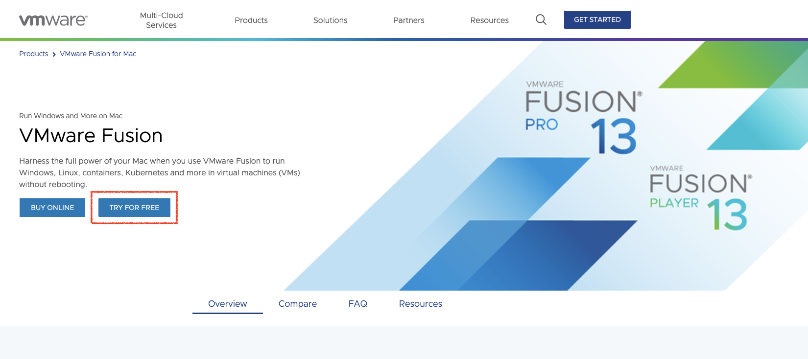
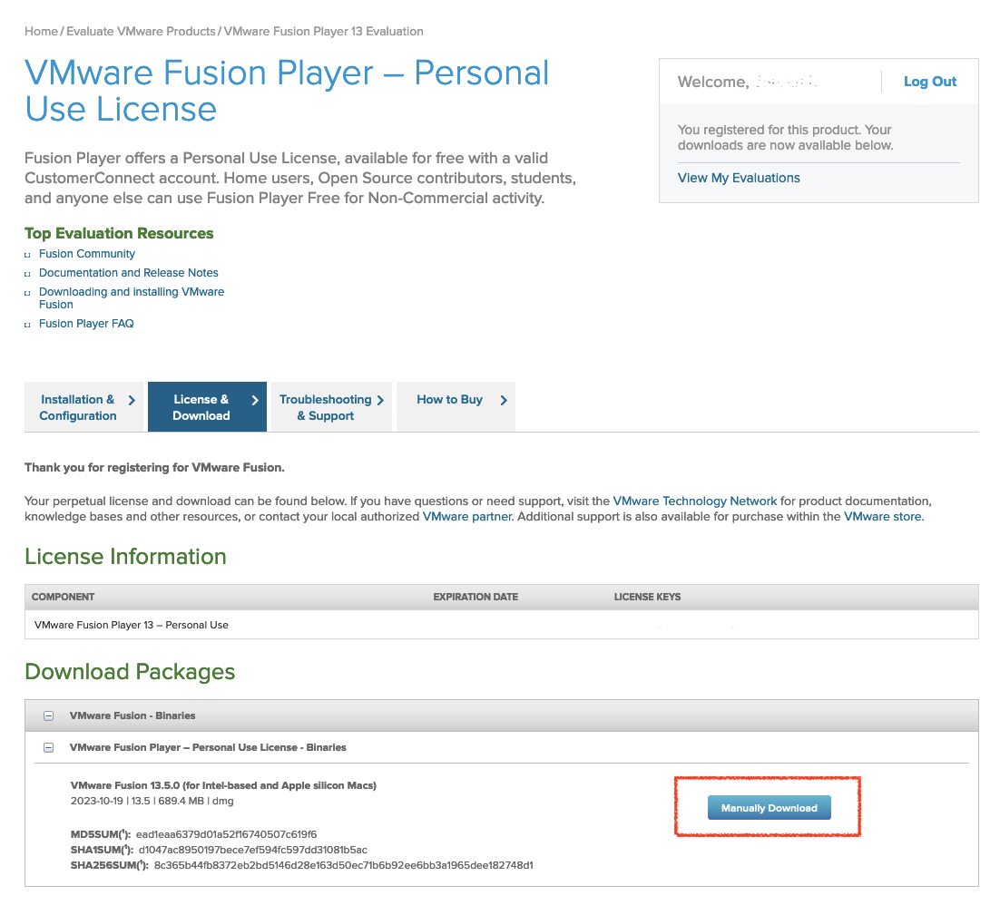

{}
You need to be running at least VMware Fusion 13.x.x. 

Due to a limitation of the VMware updater software, if you are on an earlier version, it will report that there are no updates available. You need to go to VMware's website and download and install manually.
{}

We will first go to [Get Fusion](https://www.vmware.com/products/fusion.html) and select whether we would like to buy the Pro version, or start free. 

After creating an account/registering with VMware this will allow you to request a personal use license for VMware Fusion.

Version 13.x.x Download.

Then install by double clicking.

Next download the "installer Image" from (https://www.kali.org/get-kali/#kali-installer-images). Just make sure to choose the Apple Silicon (ARM64) Image.

Take note of the directory where the .iso is saved, as we will need it for installing in VMware Fusion.

After installing VMware Fusion 13, and opening the application for the first time, it forces the user to create a new machine. Once you've created your machine, if you would like to create another you will need to select "create new machine" fomr the options.

Open the directory in which the .iso was saved after downloading.
Drag the freshly downloaded .iso to the window and begin the installation (Debian 12.x 64-bit Arm).
We can also just simply click on "install from disk or image", or "use another disc, or disc image" option from the VMware Fusion application window.

