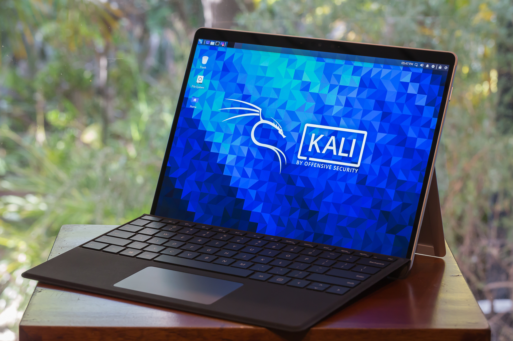
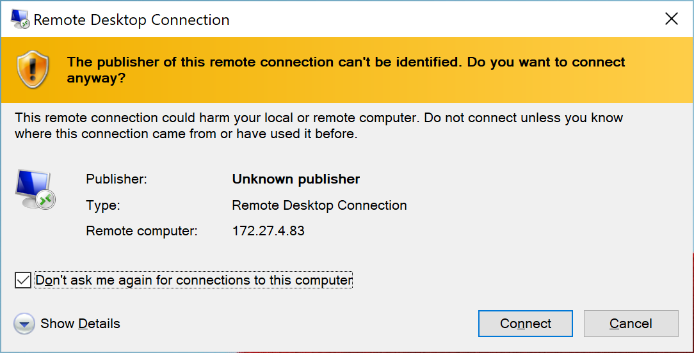
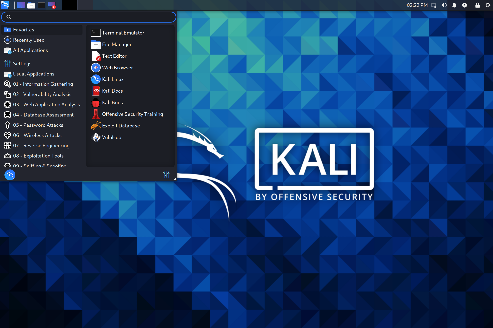
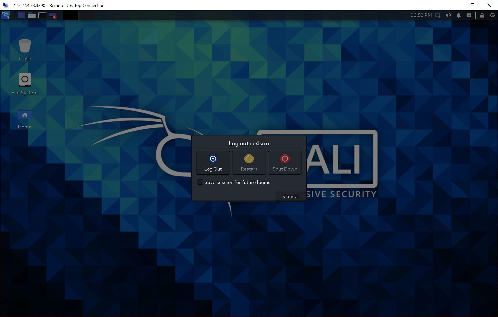

Win-KeX in Enhanced Session Mode (ESM) will run a Kali Linux desktop session in a separate window using protocols and clients native to Windows. ESM mode is the only supported mode on ARM devices.

ESM mode helps to keep the Windows and Kali environments visually apart.

Win-KeX utilises [xrdp](http://xrdp.org/) server and Microsoft's native Remote Desktop Protocol (RDP) client.

Using the native Microsoft client might yield a crispier GUI on HiDPI devices. The downside is that it is not as fast as [--win](/docs/wsl/win-kex-win/) or [--sl](/docs/wsl/win-kex-sl/) modes to the increased pixel density.

## Usage

### Start Session

- Run Kali in WSL
- Start Win-KeX as normal user in ESM mode with sound via: `kex --esm --sound`
**NOTE**: As of the time of this writing, Windows on ARM contains a bug causing massive packet loss when using `localhost` instead of the IP address to connect to the Kali container. As a workaround, use the `--ip` command line switch on ARM devices, i.e.: `kex --esm --ip --sound`

The disadvantage of using `--ip` is that you have to re-enter the ESM password each time you reboot the machine, as the credentials are stored using the sessions name, which changes after every reboot. Once Microsoft fixes the bug, we can drop the `--ip` and live happily ever after without having to type in the password again.

**NOTE**: ESM mode is the default Win-KeX mode on ARM devices so `--esm` can be omitted in all commands on this page if you are running Windows on ARM.

- You will be prompted to set an RDP server password during first launch. This is the password of the kali user you would like to login with. The password is store in the Windows credential store and can be changed later via: `kex --esm --passwd`

Tick "Don't ask me again" and confirm the following warnings:

This will start the Win-KeX server and launch the Win-KeX client in full screen mode:

### Start Root Session

- Start Win-KeX as root in window mode via: `sudo kex --esm`
- You will be prompted to set an ESM server password during first launch. This is the password for the kali root user.
  - The password can be changed later via: `sudo kex --esm --passwd`

This will start the Win-KeX server as root and launch the Win-KeX client in full screen mode.

### Sound Support

- Win-KeX includes pulse audio support
- To start Win-KeX with sound support, add `--sound` or `-s`, e.g.: `kex --esm --sound`

### Session Management

- You can disconnect from active sessions by closing the RDP client; this will close the client but leave the session running in the background
- You can re-connect to a session by typing: `kex --esm --start-client`

### Stop Session

- To close the Win-KeX client, log out of the Kali GUI session

- To optionally shutdown the Win-KeX SL mode, type: `kex --esm --stop`

Enjoy Win-KeX!
