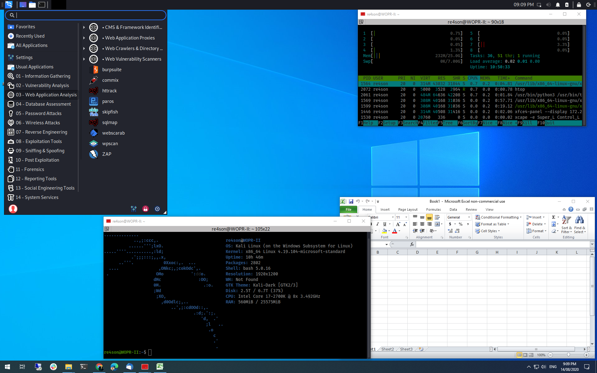

Win-KeX in Seamless Mode (SL) will launch a Kali Linux panel on the screen top of the Windows desktop.

Applications started via the panel will share the desktop with Microsoft Windows applications.

Seamless mode removes the visual segregation between Linux and Window apps and offers a great platform to run a penetration test in Kali Linux and copy the results straight into a Windows app for the final report.

Win-KeX utilises [VcXsrv Windows X Server](https://sourceforge.net/projects/vcxsrv/) to achieve seamless desktop integration.

## Prerequisites

- VcXsrv requires [Visual C++ Redistributable for Visual Studio 2015](https://www.microsoft.com/en-US/download/details.aspx?id=48145) (`vcredist140`)
  - It should be included in standard Windows installations but if you receive an error complaining that it is missing, just download and install it
- (Optional, but recommended) [VcXsrv running directly on the host](https://sourceforge.net/p/vcxsrv/wiki/VcXsrv%20%26%20Win10/)
  - [Setup VcXsrv](https://github.com/microsoft/WSL/issues/4106#issuecomment-502920377)
  - Start -> Settings -> Update & Security -> Windows Security -> Open Windows Security
    Firewall & network projection -> Allow an app through the firewall -> Change settings -> Select both entries of "VcXsrv windows server" -> OK
  - [Add inbound firewall rules to project the X server](https://x410.dev/cookbook/wsl/protecting-x410-public-access-for-wsl2-via-windows-defender-firewall/)
<!--
  This is due to a chance with either WSL or package, and VcXsrv gives errors:
[...]
(II) GLX: Initialized Win32 native WGL GL provider for screen 0

[xkb] Starting '"\\wsl.localhost\kali-linux\usr\lib\win-kex\VcXsrv\xkbcomp" -w 1 "-R\\wsl.localhost\kali-linux\usr\lib\win-kex\VcXsrv\xkbdata" -xkm "C:\Users\<username>\AppData\Local\Temp\xkb_a36312" -em1 "The XKEYBOARD keymap compiler (xkbcomp) reports:" -emp "> " -eml "Errors from xkbcomp are not fatal to the X server" "C:\Users\<username>\AppData\Local\Temp\server-3.xkm"' failed: Funzione non corretta.
(EE) Error compiling keymap (server-3) executing '"\\wsl.localhost\kali-linux\usr\lib\win-kex\VcXsrv\xkbcomp" -w 1 "-R\\wsl.localhost\kali-linux\usr\lib\win-kex\VcXsrv\xkbdata" -xkm "C:\Users\<username>\AppData\Local\Temp\xkb_a36312" -em1 "The XKEYBOARD keymap compiler (xkbcomp) reports:" -emp "> " -eml "Errors from xkbcomp are not fatal to the X server" "C:\Users\<username>B\AppData\Local\Temp\server-3.xkm"'
(EE) XKB: Couldn't compile keymap

(EE) XKB: Failed to load keymap. Loading default keymap instead.

[xkb] Starting '"\\wsl.localhost\kali-linux\usr\lib\win-kex\VcXsrv\xkbcomp" -w 1 "-R\\wsl.localhost\kali-linux\usr\lib\win-kex\VcXsrv\xkbdata" -xkm "C:\Users\<username>\AppData\Local\Temp\xkb_a36312" -em1 "The XKEYBOARD keymap compiler (xkbcomp) reports:" -emp "> " -eml "Errors from xkbcomp are not fatal to the X server" "C:\Users\<username>\AppData\Local\Temp\server-3.xkm"' failed: Funzione non corretta.
(EE) Error compiling keymap (server-3) executing '"\\wsl.localhost\kali-linux\usr\lib\win-kex\VcXsrv\xkbcomp" -w 1 "-R\\wsl.localhost\kali-linux\usr\lib\win-kex\VcXsrv\xkbdata" -xkm "C:\Users\<username>\AppData\Local\Temp\xkb_a36312" -em1 "The XKEYBOARD keymap compiler (xkbcomp) reports:" -emp "> " -eml "Errors from xkbcomp are not fatal to the X server" "C:\Users\<username>\AppData\Local\Temp\server-3.xkm"'
(EE) XKB: Couldn't compile keymap

XKB: Failed to compile keymap
Keyboard initialization failed. This could be a missing or incorrect setup of xkeyboard-config.

(EE)
Fatal server error:
(EE) Failed to activate virtual core keyboard: 2(EE)
(EE) Server terminated with error (1). Closing log file.
-->

## Usage

### Start Session

- Start Win-KeX as normal user in seamless mode via: `kex --sl`

When starting Win-KeX SL for the first time, ensure to select **Public networks** when asked for authorisation to allow traffic through the Windows Defender firewall

This will start Win-KeX in seamless mode:

The Kali panel is placed at the top of the screen and the Windows Start menu at the bottom.

- - -

**Tip**: The Kali panel might cover the title bar of maximised windows.
To prevent it getting in the way you may prefer to set it to "Automatically hide" in the panel preferences.

### Sound Support

- Win-KeX includes pulse audio support
- To start Win-KeX with sound support, add `--sound` or `-s`, e.g.: `kex --win --sound`
- When starting Win-KeX with sounds support for the first time, ensure to select **Public networks** when asked for authorization to allow traffic through the Windows Defender firewall

### Multiscreen Support

Win-KeX supports multiscreen setups.

Open "Panel Preference" to reduce the panel length, untick "Lock panel" and move the panel to the desired screen.

### Stop Session

- To close Win-KeX SL, simply log out of the session via the "Logout" button in the panel.
- To optionally shutdown the Win-KeX SL server, type: `kex --sl --stop`

Enjoy Win-KeX!
