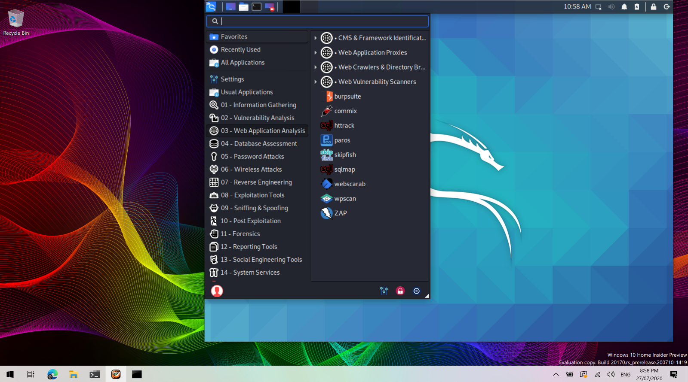
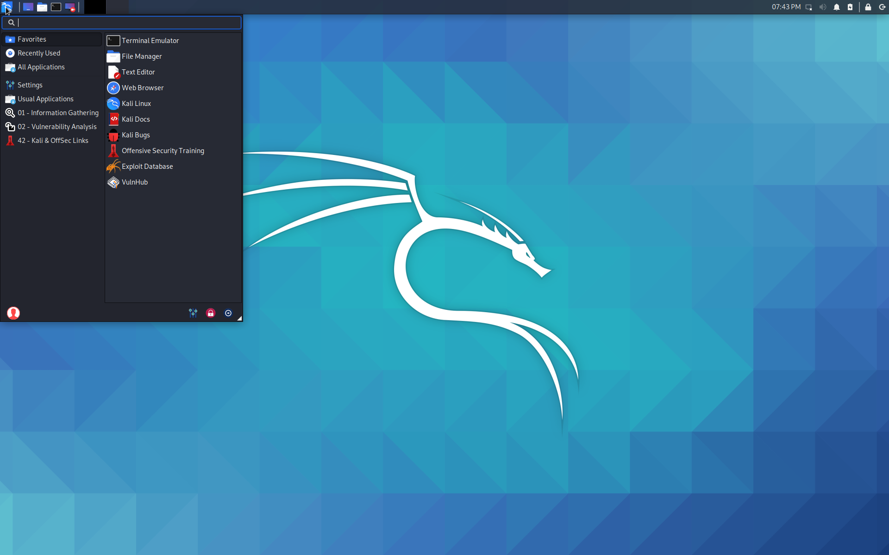
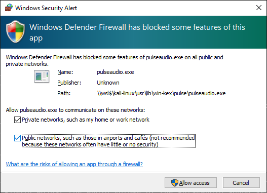
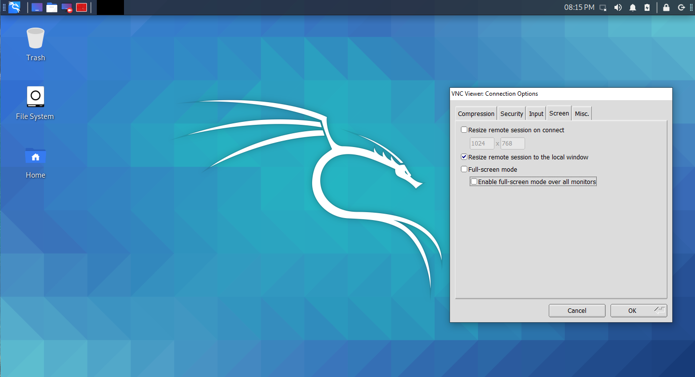

## Overview

Win-KeX in Window Mode (Win) will run a Kali Linux desktop session in a separate window.

Window mode helps keeping the Windows and Kali environments visually apart.

Win-KeX utilises [TigerVNC](https://tigervnc.org/) for its client and server components.

## Usage

### Start Session

- Start Win-KeX as normal user in window mode via: `kex --win`
  - Or simply via: `kex`
  - **NOTE**: Window mode is the default Win-KeX mode so `--win` can be omitted in all commands on this page.

- You will be prompted to set a VNC server password during first launch.
  - The password can be changed later via `kex --passwd`

This will start the Win-KeX server and launch the Win-KeX client in full screen mode:

### Start Root Session

- Start Win-KeX as root in window mode via: `sudo kex --win`
- You will be prompted to set a VNC server password during first launch.
  - The password can be changed later via: `sudo kex --passwd`

This will start the Win-KeX server as root and launch the Win-KeX client in full screen mode.

**NOTE**: The Win-KeX client always prompts for the VNC server password when connecting to a root session.

### Session Management

- Pressing **F8** will open the client's context menu, which allows to manage the client sessions, e.g. close the client, switch between full screen and window, etc.)
- You can disconnect from active sessions by pressing **F8** -> Exit viewer. This will close the client but leave the session running in the background
- You can re-connect to a session by typing: `kex --win --start-client`

### Sound Support

- Win-KeX includes pulse audio support
- To start Win-KeX with sound support, add `--sound` or `-s`, e.g.: `kex --win --sound`
- When starting Win-KeX with sounds support for the first time, ensure to select **Public networks** when asked for authorisation to allow traffic through the Windows Defender firewall

### Multiscreen Support

- Win-KeX supports multiscreen setups:
  Press **F8** an go to Options -> Screen. Then untick "Enable full-screen mode over all monitors" & "Full screen mode", move Win-KeX to the desired screen and re-enable full-screen mode

### Stop Session

- To close the Win-KeX client, press **F8** and select "Exit viewer"
- To optionally shutdown Win-KeX Win mode, type: `kex --win --stop`

Enjoy Win-KeX!
