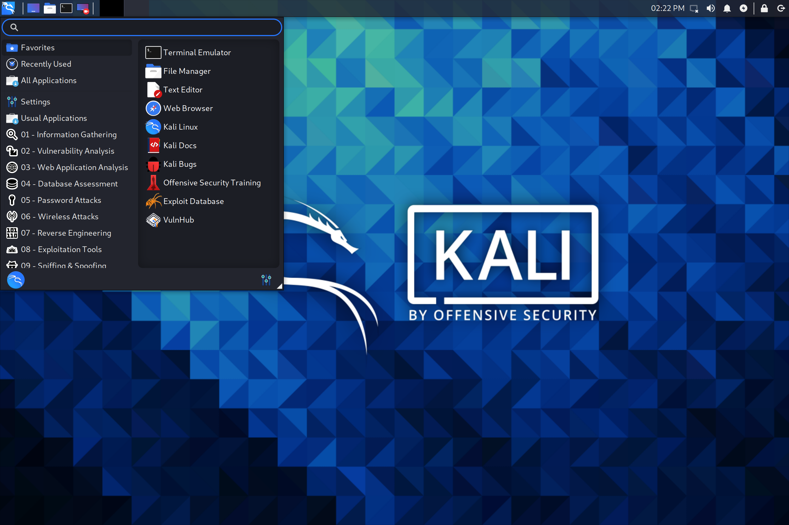
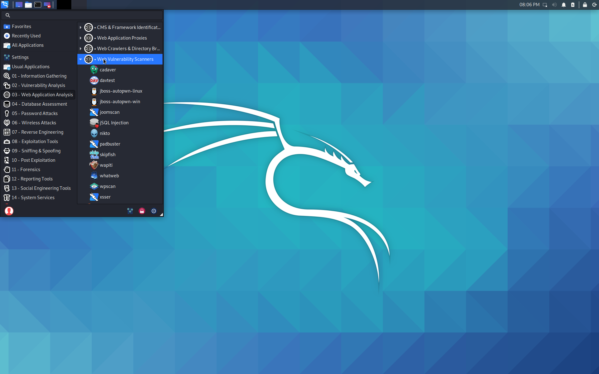
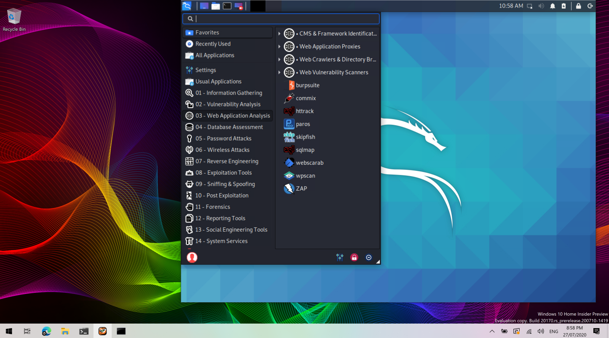

Win-KeX provides a GUI desktop experience for Kali Linux in Windows Subsystem for Linux (WSL 2) with the following features:

- [Window mode](/docs/wsl/win-kex-win/): start a Kali Linux desktop in a dedicated window <!-- VNC/tigervncserver -->
- [Seamless mode](/docs/wsl/win-kex-sl/): share the Windows desktop between Windows and Kali application and menus <!-- VcXsrv/xfdesktop -->
- [Enhanced session mode](/docs/wsl/win-kex-esm/): Similar to Hyper-V, uses RDP for a more feature rich experience <!-- RDP/xRDP -->
- Sound support <!-- pulse -->
- Shared clipboard for cut and paste support between Kali Linux and Windows
- Root & unprivileged session support
- Multi-session support: root window & non-privileged window & seamless sessions concurrently
- Fully compatible with WSLg


This page details the steps to install Win-KeX in under 2 minutes.

## Installation

All installation steps, up to the point where we install Win-KeX, are also explained in the 5 minute video guide by [NetworkChuck](https://twitter.com/NetWorkChuck): [New Kali Linux GUI on Windows 10 (WSL 2) // 2020.3 Release](https://www.youtube.com/watch?v=dgdOILL1184)



### Prerequisites

- [Kali in WSL 2](/docs/wsl/wsl-preparations/)
- [Windows Terminal](https://www.microsoft.com/en-us/p/windows-terminal/9n0dx20hk701)

### Install Win-KeX

Inside of Kali WSL, install Win-KeX via:

```console
kali@kali:~$ sudo apt update
kali@kali:~$
kali@kali:~$ sudo apt install -y kali-win-kex
```
<!--
> 23 upgraded, 1024 newly installed, 0 to remove and 28 not upgraded.
> Need to get 692 MB of archives.
> After this operation, 2,395 MB of additional disk space will be used.
-->

## Run Win-KeX

Win-KeX supports the following three modes.

### Window Mode


To start Win-KeX in Window mode with sound support, run either:

- Inside of Kali WSL: `kex --win -s`
- On Window's command prompt: `wsl -d kali-linux kex --win -s`

Refer to the [Win-KeX Window Mode usage documentation](/docs/wsl/win-kex-win/) for further information.

### Enhanced Session Mode



To start Win-KeX in Enhanced Session Mode with sound support and ARM workaround, run either:

- Inside of Kali WSL: `kex --esm --ip -s`
- On Window's command prompt: `wsl -d kali-linux kex --esm --ip -s`

Refer to the [Win-KeX Enhanced Session Mode usage documentation](/docs/wsl/win-kex-esm/) for further information.

### Seamless Mode


To start Win-KeX in Seamless mode with sound support, run, run either:

- Inside of Kali WSL: `kex --sl -s`
- On Window's command prompt: `wsl -d kali-linux kex --sl -s`

Refer to the [Win-KeX SL usage documentation](/docs/wsl/win-kex-sl/) for further information.

## Optional Steps

### Kali's Default Tools

If you have the space, why not install "Kali with the lot"? This will also give you the traditional "default" tools of Kali that you may expect:

```
sudo apt install -y kali-linux-large
```



### Windows Terminal

Create a [Windows Terminal](https://www.microsoft.com/en-us/p/windows-terminal/9n0dx20hk701) shortcut:


Choose amongst these options:

**Basic Win-KeX in window mode with sound**:

```plaintext
{
      "guid": "{55ca431a-3a87-5fb3-83cd-11ececc031d2}",
      "hidden": false,
      "name": "Win-KeX",
      "commandline": "wsl -d kali-linux kex --wtstart -s",
},
```

**Advanced Win-KeX in window mode with sound - Kali icon and start in kali home directory**:

Copy the `kali-menu.png` icon across to your windows picture directory and add the icon and start directory to your WT config:

```plaintext
{
        "guid": "{55ca431a-3a87-5fb3-83cd-11ececc031d2}",
        "hidden": false,
        "icon": "file:///c:/users/<windows user>/pictures/icons/kali-menu.png",
        "name": "Win-KeX",
        "commandline": "wsl -d kali-linux kex --wtstart -s",
        "startingDirectory" : "//wsl$/kali-linux/home/<kali user>"
},
```

- - -

**Basic Win-KeX in seamless mode with sound**:

```plaintext
{
      "guid": "{55ca431a-3a87-5fb3-83cd-11ececc031d2}",
      "hidden": false,
      "name": "Win-KeX",
      "commandline": "wsl -d kali-linux kex --sl --wtstart -s",
},
```

- - -

**Advanced Win-KeX in seamless mode with sound - Kali icon and start in kali home directory**:

Copy the `kali-menu.png` icon across to your windows picture directory and add the icon and start directory to your WT config:

```plaintext
{
        "guid": "{55ca431a-3a87-5fb3-83cd-11ececc031d2}",
        "hidden": false,
        "icon": "file:///c:/users/<windows user>/pictures/icons/kali-menu.png",
        "name": "Win-KeX",
        "commandline": "wsl -d kali-linux kex --sl --wtstart -s",
        "startingDirectory" : "//wsl$/kali-linux/home/<kali user>"
},
```

- - -

**Basic Win-KeX in ESM mode with sound**:

```plaintext
{
      "guid": "{55ca431a-3a87-5fb3-83cd-11ecedc031d2}",
      "hidden": false,
      "name": "Win-KeX",
      "commandline": "wsl -d kali-linux kex --esm --wtstart -s",
},
```

- - -

**Advanced Win-KeX in ESM mode with sound - Kali icon and start in kali home directory**:

Copy the `kali-menu.png` icon across to your windows picture directory and add the icon and start directory to your WT config:

```plaintext
{
        "guid": "{55ca431a-3a87-5fb3-83cd-11ecedd031d2}",
        "hidden": false,
        "icon": "file:///c:/users/<windows user>/pictures/icons/kali-menu.png",
        "name": "Win-KeX",
        "commandline": "wsl -d kali-linux kex --esm --wtstart -s",
        "startingDirectory" : "//wsl$/kali-linux/home/<kali user>"
},
```




Enjoy Win-KeX!

## Help

For more information, ask for help via:

- `kex --help`
- `man kex`
- [Kali Forums](https://forums.kali.org/)
