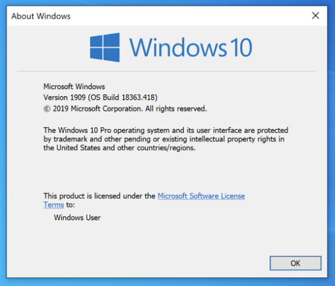
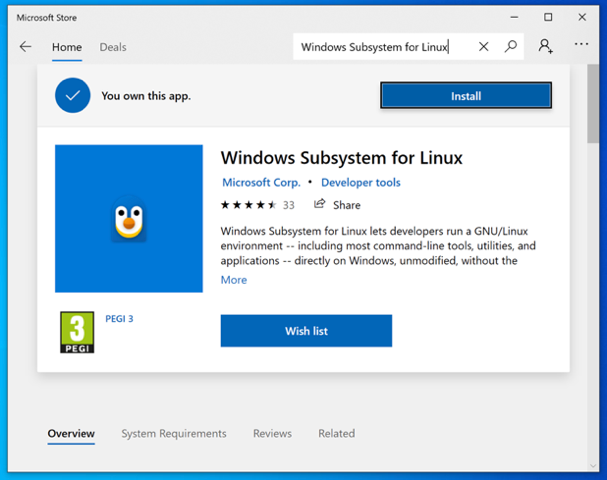

<!--
     VM setup:
     -   4x CPU
     -  8GB RAM
     - 64GB HDD
-->

Windows Subsystem for Linux (WSL) has [two different versions](https://docs.microsoft.com/en-us/windows/wsl/compare-versions), "WSL 1" and "WSL 2". **WSL 2 is the preferred** and default option when installing WSL. This is because WSL 2 uses the actual Linux kernel inside a Hyper-V virtual machine (managed by WSL). WSL 1 uses a "translation layer" which is similar to [WINE](https://www.winehq.org/).

We recommend using Windows 11 as it is simpler, however if you are using Window 10 it is still possible but requires additional steps in places.
To make Windows 10 easier, having the machine as up-to-date as possible will help - as of the time of writing this, November 2022 patches.

_If installing in a Virtual Machine, make sure to allow for "nested VM" (nested virtualization allows for a "VM in a VM")._

<!--
     WSL Error: 0x80370102
     Fix for VMware Fusion: Virtual Machine -> Settings... -> Process & Memory -> Advance options -> Enable: Enable hypervisor applications in this virtual machine
-->

## Quick Method

Our recommended method to get Kali running on WSL 2:

<!--
Better method?:
1. Start -> Settings -> Windows Update -> Apply any Windows updates which are available   (Want at least November 2022 patches)
   - Enable: Updates for other Microsoft products when you update Windows
   - Don't need to _upgrade_ just update Windows - and skipping optional updates!
2. Restart
3. Repeat step 1 & 2 until there is no more updates
4. wsl --install --no-distribution
   - Will install from the [Microsoft Store: Windows Subsystem for Linux](https://apps.microsoft.com/store/detail/windows-subsystem-for-linux/9P9TQF7MRM4R) (November 2022 patches)
5. Restart
6. wsl --set-default-version 2
7. wsl --install --distribution kali-linux
   - Will install from the [Microsoft Store: Kali Linux](https://apps.microsoft.com/store/detail/kali-linux/9PKR34TNCV07) (November 2022 patches)
8. Run `kali` to finish the initial setup of creating a new user

Safety net for outdated Windows 10 method:
-->

1. Open a administrator command prompt and run:

```powershell
dism.exe /online /enable-feature /featurename:VirtualMachinePlatform /all /norestart
dism.exe /online /enable-feature /featurename:Microsoft-Windows-Subsystem-Linux /all
```

2. Restart when prompt
3. Download and install the WSL 2 Linux Kernel from here: [aka.ms/wsl2kernel](https://aka.ms/wsl2kernel)
3. Restart
4. Open a command prompt and run:

```powershell
wsl --set-default-version 2
```

5. Install from the [Microsoft Store: Kali Linux](https://apps.microsoft.com/store/detail/kali-linux/9PKR34TNCV07)
   - **NOTE**: If there is an existing Kali WSL 1, upgrade it by running: `wsl --set-version kali-linux 2`
6. Run `kali` to finish the initial setup of creating a new user

## Windows Version

Windows 11 users have an easier time and can go straight to [installing WSL](#install-wsl-1), however if you are using Windows 10 you will need to check your OS build/version. The minimum requirements for WSL is different and needs either to match or be higher than:

- WSL 1: Build: `16215`, Version: `1703` (June 2017)
- WSL 2 (x64): Build: `18362.1049`, Version: `1903` (Codename: `19H1` - May 2019)
  - _**Recommended** - Build: `19041`, Version: `2004` (Codename: `20H1` - May 2020)_
- WSL 2 (ARM64): Build: `19041`, Version: `2004` (Codename: `20H1` - May 2020)
<!-- https://devblogs.microsoft.com/commandline/wsl-2-support-is-coming-to-windows-10-versions-1903-and-1909/ -->

The reason why Windows 10 `20H1` is recommended, is due to the WSL helper-script already pre-installed, allowing for quick command line installation.
By having an updated Windows 10 version, the WSL helper-script will also pull in updates from the Microsoft store.
The reason why Windows 11 is preferred over Windows 10, is due to internal hardcoded URLs which have not yet been back ported which hopefully will be addressed soon.

### Check Version

We can check our build version by pressing **WIN**+**R** and then typing in `winver`. We will be shown a pop-up like this:
<!-- Can also use `ver` for CLI, but doesn't give all the same information - `systeminfo` gives too much -->



What we are looking for is the number after **OS Build**.
Our build is `18363` _(with a minor build: `418`)_. This means we can use either WSL 1 or WSL 2 (but will require some manual steps)!

<!--
### Check patches

TODO: systeminfo to see what patches applied
-->

## Install WSL 1

There is a hard requirement to enable WSL via Window's "Optional Features". However, you can optionally update WSL by using the [Microsoft Store: Windows Subsystem for Linux](#wsl-in-microsoft-store), to expand its functionality and bug fixes.

There are a few ways to install WSL (WSL 1 or WSL 2):

- [WSL helper-script](#wsl-helper-script) (**Simplest**)
  - _Requires Windows 10 `20H1` (Build: `19041`, Version: `2004`) or higher_
  - Will also install WSL 2
  - _November 2022 patches gives a better experience_ <!-- due to it pulling updates from the Microsoft store to be the most up-to-date -->
- [Dism](#dism) (**Recommended**)
- [PowerShell](#powershell)

Depending on your Windows version and patches, will have an affect on your installation experience.

### WSL helper-script

This is the easiest way to install, but you do have to have Windows 10 `20H1` (Build: `19041`, Version: `2004`) or higher, otherwise when trying to follow, you will get: `'wsl' is not recognized as an internal or external command, operable program or batch file.`.
<!-- This is because WSL 2 was back ported for older Windows versions, and was initially released for this version which is why older versions are supported, but this command is not offered -->

This WSL helper-script method will install WSL and Kali _(unlike the other methods)_. It will cover both WSL 1 and WSL 2, which means it will enable Hyper-V VM & setup the WSL kernel.
The down side is to it, if you are using **Windows 10 before November 2022 patches**, due to a known issue this method will install an **out-dated version of Kali** on WSL (Kali 2019.2).
The [November 2022 patches](https://devblogs.microsoft.com/commandline/the-windows-subsystem-for-linux-in-the-microsoft-store-is-now-generally-available-on-windows-10-and-11/) will make the helper-script also include pulling from the Microsoft store (both [WSL](#wsl-in-microsoft-store) and [Kali](#kali-in-microsoft-store)).
<!-- wrapper/helper-script which gets replaced with the 'real' program on install -->

Inside a Administrator command prompt, run the following command which will setup WSL if it has not already **and** [install Kali WSL](#install-kali-wsl):
<!-- Don't need admin with November 2022, will prompt to upgrade -->

```powershell
C:\Windows\system32>wsl --install --distribution kali-linux
Installing: Virtual Machine Platform
Virtual Machine Platform has been installed.
Installing: Windows Subsystem for Linux
Windows Subsystem for Linux has been installed.
Downloading: WSL Kernel
Installing: WSL Kernel
WSL Kernel has been installed.
Downloading: Kali Linux Rolling
The requested operation is successful. Changes will not be effective until the system is rebooted.

C:\Windows\system32>
```

<!--
    List which distribution possibilities:
    C:\Windows\system32> wsl --list --online

    Will pull Ubuntu down by default. November 2022 allows for:
    C:\Windows\system32> wsl --install --no-distribution
-->

After rebooting the box, logging back in, a terminal window should hopefully open up if everything was successful:

```plaintext
Installing, this may take a few minutes...
Please create a default UNIX user account. The username does not need to match your Windows username.
For more information visit: https://aka.ms/wslusers
Enter new UNIX username:
```

You can then setup a user and then you are in:

```console
Enter new UNIX username: kali
New password:
Retype new password:
passwd: password updated successfully
Installation successful!
kali@DESKTOP-AJVAG8O:~$ uname -a
Linux DESKTOP-AJVAG8O 5.10.16.3-microsoft-standard-WSL2 #1 SMP Fri Apr 2 22:23:49 UTC 2021 x86_64 GNU/Linux
kali@DESKTOP-AJVAG8O:~$
```

**NOTE**: You will not see anything when typing the password.

_Due to a known issue with Windows 10 before November 2022 patches, this method may install an out-dated version of Kali on WSL (Kali 2019.2). It is recommended to then [re-install Kali](#install-kali-wsl) from the Microsoft Store. Later versions, including Windows 11 are unaffected._
<!-- https://github.com/microsoft/WSL/pull/8774 -->

### Dism

Using an Administrator command prompt, run the following commands:

_As we will want WSL 2 later, we run the first command with `VirtualMachinePlatform` now. This is not required for WSL 1, and can be removed in the command._

```powershell
C:\Windows\system32>dism.exe /online /enable-feature /featurename:VirtualMachinePlatform /all /norestart

Deployment Image Servicing and Management tool
Version: 10.0.18362.1

Image Version: 10.0.18363.418

Enabling feature(s)
[==========================100.0%==========================]
The operation completed successfully.

C:\Windows\system32>
C:\Windows\system32>dism.exe /online /enable-feature /featurename:Microsoft-Windows-Subsystem-Linux /all

Deployment Image Servicing and Management tool
Version: 10.0.18362.1

Image Version: 10.0.18363.418

Enabling feature(s)
[==========================100.0%==========================]
The operation completed successfully.
Restart Windows to complete this operation.
Do you want to restart the computer now? (Y/N)
```

And then reboot when prompted!

We can now either [install Kali WSL](#install-kali-wsl), or we can [upgrade to WSL 2](#manually-upgrade-wsl-1-to-wsl-2).

### PowerShell

At an Administrator PowerShell prompt, run the following command to install from optional features:

_As we will want WSL 2 later, we will also include `VirtualMachinePlatform` now. This is not required for WSL 1, and can be removed in the command._

```powershell
PS C:\Windows\system32> Enable-WindowsOptionalFeature -Online -FeatureName Microsoft-Windows-Subsystem-Linux,VirtualMachinePlatform
Do you want to restart the computer to complete this operation now?
[Y] Yes  [N] No  [?] Help (default is "Y"):
```

And then reboot when prompted!

We can now either [install Kali WSL](#install-kali-wsl), or we can [upgrade to WSL 2](#manually-upgrade-wsl-1-to-wsl-2).

<!--

### GitHub

https://github.com/microsoft/WSL/releases

-->

## Manually Upgrade WSL 1 to WSL 2

**VM Platform**:

If we installed WSL either by [PowerShell](#powershell) or [Dism](#dism), we **may** have already installed the `VirtualMachinePlatform` feature (which is Hyper-V).
Otherwise, you will need to [run as administrator](#dism): `dism.exe /online /enable-feature /featurename:VirtualMachinePlatform /all /norestart`

**WSL Linux Kernel**:

Next we still need is to manually install the WSL Linux kernel update. This can be downloaded from:

- [wsl_update_x64.msi](https://wslstorestorage.blob.core.windows.net/wslblob/wsl_update_x64.msi)
- [wsl_update_arm64.msi](https://wslstorestorage.blob.core.windows.net/wslblob/wsl_update_arm64.msi)
<!-- https://learn.microsoft.com/en-gb/windows/wsl/install-manual -->

After installing (with administrator privileges), reboot the machine.

**WSL Default Version**:

We can now set any WSL distributions which is installed **after this point** to be WSL 2 by running the following in a command prompt:

```powershell
C:\Users\Win>wsl --set-default-version 2
For information on key differences with WSL 2 please visit https://aka.ms/wsl2
The operation completed successfully.

C:\Users\Win>wsl --install --distribution kali-linux
[...]
```

<!--
     Check by:
     PS C:\Users\Win> Get-ItemPropertyValue `
     >>       -Path HKCU:\SOFTWARE\Microsoft\Windows\CurrentVersion\Lxss `
     >>       -Name DefaultVersion
     2
     PS C:\Users\Win>
-->

Now when we install Kali, it will be WSL 2.

**Upgrade WSL Distributions**:

However, if we have previously installed Kali WSL 1, we can upgrade it by doing:

```powershell
C:\Users\Win>wsl --list --verbose
  NAME          STATE           VERSION
* kali-linux    Stopped         1

C:\Users\Win>
C:\Users\Win>wsl --set-version kali-linux 2
Conversion in progress, this may take a few minutes...
For information on key differences with WSL 2 please visit https://aka.ms/wsl2
Conversion complete.

C:\Users\Win>
C:\Users\Win>wsl --list --verbose
  NAME          STATE           VERSION
* kali-linux    Stopped         2

C:\Users\Win>
C:\Users\Win>kali
[...]
```

Done!

## WSL in Microsoft Store

You need to have enable Microsoft's Windows Subsystem Linux optional features for this to work, as this is for updating WSL, rather than [installing](#dism) it.
The Microsoft Store means, you are on the latest versions, as [updates are issued](https://devblogs.microsoft.com/commandline/a-preview-of-wsl-in-the-microsoft-store-is-now-available/) outside of the Window's update cycle _("Patch Tuesday")_.
<!--
  > This application requires the Windows Subsystem for Linux Optional Component.
  > The system may need to be restarted so the changes can take effect.
  > Press any key to continue...
-->

It does require you to make sure your Windows up-to-date in order for this to work (with update patches applied not OS upgrades).
<!--
  Its one thing to install from WSL store, but also then running the program does another version check.
  - Install: It does require Windows 10 `20H1` (Build: `19041`, Version: `2004`) or higher.
    Store -> WSL -> System Requirements: Windows 10 version 19041.0 or higher
  - Run: November 2022 patches - KB5020030 (November 15, 2022)
    https://www.catalog.update.microsoft.com/Search.aspx?q=%20(KB5020030)
    > Windows version 10.0.19045.2006 does not support the packaged version of Windows Subsystem for Linux.
    > Install the required update via Windows update or via: https://aka.ms/store-wsl-kb-win10
    > For information please visit https://aka.ms/wslinstall
    > Error code: Wsl/WSL_E_OS_NOT_SUPPORTED
    > Press any key to continue...
-->

_Windows 10 years, if you have November 2022 patches applied, `wsl --install` becomes a shortcut to the Microsoft Store (both [WSL](#wsl-in-microsoft-store) and [Kali](#kali-in-microsoft-store))._


After having enabled the optional feature, go to the [Microsoft Store](https://apps.microsoft.com/store/detail/windows-subsystem-for-linux/9P9TQF7MRM4R), search for `Windows Subsystem for Linux` and click "Install":



_It is not a requirement to sign-in. You may also get UAC prompt during installation._

After it has downloaded & installed, you will need to reboot.

This will get your machine ready for WSL 1. For WSL 2, you still need the [enable Hyper-V & WSL kernel](#manually-upgrade-wsl-1-to-wsl-2).

## Install Kali WSL

Once WSL 1 or WSL 2 has been setup, there are a few ways you can install Kali on WSL:

- [Microsoft Store](#kali-in-microsoft-store) (**Recommended** & **Most Up-To-Date**)
- [WSL helper-script](#wsl-helper-script---install) (**Simplest**)
- [Import rootfs](#import-rootfs)
- [Import AppxBundle](#import-appxbundle)

**NOTE**: It is NOT recommend to try and overwrite install methods to switch. Please do `wsl --unregister kali-linux` first.

### Kali in Microsoft Store

You can use either the graphical [Microsoft Store](https://apps.microsoft.com/store/detail/kali-linux/9PKR34TNCV07), or you can pull directly down via PowerShell.

_Windows 10 years, if you have November 2022 patches applied, `wsl --install` becomes a shortcut to the Microsoft Store (both [WSL](#wsl-in-microsoft-store) and [Kali](#kali-in-microsoft-store))._

By going to the [Microsoft Store: Kali Linux](https://apps.microsoft.com/store/detail/kali-linux/9PKR34TNCV07), click "Install".
After it has finished downloading, clicking "Launch" should finish installation of creating a new user:

```powershell
Installing, this may take a few minutes...
Please create a default UNIX user account. The username does not need to match your Windows username.
For more information visit: https://aka.ms/wslusers
Enter new UNIX username: kali
New password:
Retype new password:
passwd: password updated successfully
Installation successful!
┏━(Message from Kali developers)
┃
┃ This is a minimal installation of Kali Linux, you likely
┃ want to install supplementary tools. Learn how:
┃ ⇒ https://www.kali.org/docs/troubleshooting/common-minimum-setup/
┃
┗━(Run: “touch ~/.hushlogin” to hide this message)
┌──(kali㉿DESKTOP-AJVAG8O)-[~]
└─$ uname -a
Linux DESKTOP-AJVAG8O 5.10.16.3-microsoft-standard-WSL2 #1 SMP Fri Apr 2 22:23:49 UTC 2021 x86_64 GNU/Linux

┌──(kali㉿DESKTOP-AJVAG8O)-[~]
└─$ id
uid=1000(kali) gid=1000(kali) groups=1000(kali),4(adm),24(cdrom),27(sudo),30(dip),46(plugdev),100(users)

┌──(kali㉿DESKTOP-AJVAG8O)-[~]
└─$ grep VERSION= /etc/*release
VERSION="2023.1"

┌──(kali㉿DESKTOP-AJVAG8O)-[~]
└─$
```

**NOTE**: You will not see anything when typing the password.

#### Store + PowerShell

The quick way of doing it is to run:

```powershell
PS C:\Users\Win> Invoke-WebRequest -Uri https://aka.ms/wsl-kali-linux-new -OutFile .\kali-linux.AppxBundle -UseBasicParsing -TimeoutSec 1800
PS C:\Users\Win>
PS C:\Users\Win> Add-AppxPackage .\kali-linux.AppxBundle
```

<!-- If you use `https://aka.ms/wsl-kali-linux`, you get the outdated version - which is what Windows 10 without using the store (v1.1.4.0) -->

### WSL helper-script (--install)

_Due to a known issue with Windows 10 before November 2022 patches, this method may install an out-dated version of Kali on WSL (Kali 2019.2). It is recommended to use "Microsoft Store. Later versions, including Windows 11 are unaffected._
<!-- https://github.com/microsoft/WSL/pull/8774 -->

Using a command line prompt:

```
C:\Users\Win>wsl --install --distribution kali-linux
Downloading: Kali Linux Rolling
Installing: Kali Linux Rolling
Kali Linux Rolling has been installed.
Launching Kali Linux Rolling...

C:\Users\Win>
```

And [like before](#wsl-helper-script), a terminal window should hopefully open up:

```
Installing, this may take a few minutes...
Please create a default UNIX user account. The username does not need to match your Windows username.
For more information visit: https://aka.ms/wslusers
Enter new UNIX username: kali
New password:
Retype new password:
passwd: password updated successfully
Installation successful!
kali@DESKTOP-AJVAG8O:~$ uname -a
Linux DESKTOP-AJVAG8O 5.10.16.3-microsoft-standard-WSL2 #1 SMP Fri Apr 2 22:23:49 UTC 2021 x86_64 GNU/Linux
kali@DESKTOP-AJVAG8O:~$
kali@DESKTOP-AJVAG8O:~$ id
uid=1000(kali) gid=1000(kali) groups=1000(kali),4(adm),24(cdrom),27(sudo),30(dip),46(plugdev)
kali@DESKTOP-AJVAG8O:~$
kali@DESKTOP-AJVAG8O:~$ grep VERSION= /etc/*release
/etc/os-release:VERSION="2019.2"
kali@DESKTOP-AJVAG8O:~$
```

**NOTE**: You will not see anything when typing the password.

### Import rootfs

We can use our [WSL build-scripts](https://gitlab.com/kalilinux/build-scripts/kali-wsl-app) to generate a rootfs which can be imported to WSL.
As creating the rootfs is out of scope for this guide we will already assume it has been created.

First thing is to copy over to the machine:

```powershell
C:\Users\Win\Downloads>dir
[...]
05/04/2023  21:12    <DIR>          .
05/04/2023  21:12    <DIR>          ..
05/04/2023  21:11       217,859,650 kali-linux-rolling-wsl-rootfs-amd64.tar.gz
               1 File(s)    217,859,650 bytes
               2 Dir(s)  40,346,128,384 bytes free

C:\Users\Win\Downloads>
C:\Users\Win\Downloads>wsl --list --verbose
Windows Subsystem for Linux has no installed distributions.
Distributions can be installed by visiting the Microsoft Store:
https://aka.ms/wslstore
C:\Users\Win\Downloads>
```

Next we import the rootfs, giving it a name of `kali-wsl`, storing data in `./wsl-test` and importing from `.\kali-linux-rolling-wsl-rootfs-amd64.tar.gz`:

```powershell
C:\Users\Win\Downloads>wsl --import kali-wsl  wsl-test  .\kali-linux-rolling-wsl-rootfs-amd64.tar.gz
C:\Users\Win\Downloads>
C:\Users\Win\Downloads>dir
[...]
05/04/2023  21:13    <DIR>          .
05/04/2023  21:13    <DIR>          ..
05/04/2023  21:11       217,859,650 kali-linux-rolling-wsl-rootfs-amd64.tar.gz
05/04/2023  21:13    <DIR>          wsl-test
               1 File(s)    217,859,650 bytes
               3 Dir(s)  39,582,310,400 bytes free

C:\Users\Win\Downloads>
```

The final stage now is to use it:

```powershell
C:\Users\Win\Downloads>wsl --list --verbose
  NAME          STATE           VERSION
* kali-wsl      Stopped         2

C:\Users\Win\Downloads>
C:\Users\Win\Downloads>wsl --distribution kali-wsl
┏━(Message from Kali developers)
┃
┃ This is a minimal installation of Kali Linux, you likely
┃ want to install supplementary tools. Learn how:
┃ ⇒ https://www.kali.org/docs/troubleshooting/common-minimum-setup/
┃
┗━(Run: “touch ~/.hushlogin” to hide this message)
┌──(root㉿DESKTOP-AJVAG8O)-[/mnt/c/Users/Win/Downloads]
└─# uname -a
Linux DESKTOP-AJVAG8O 5.10.16.3-microsoft-standard-WSL2 #1 SMP Fri Apr 2 22:23:49 UTC 2021 x86_64 GNU/Linux

┌──(root㉿DESKTOP-AJVAG8O)-[/mnt/c/Users/Win/Downloads]
└─# id
uid=1000(kali) gid=1000(kali) groups=1000(kali),4(adm),24(cdrom),27(sudo),30(dip),46(plugdev),100(users)

┌──(root㉿DESKTOP-AJVAG8O)-[/mnt/c/Users/Win/Downloads]
└─#
```

### Import AppxBundle

We can use our [WSL build-scripts](https://gitlab.com/kalilinux/build-scripts/kali-wsl-rootfs) to generate a WSL app which can be imported to WSL.
As creating the AppxBundle is out of scope for this guide we will already assume it has been created.

Because it is self-signed certificate, run the `Install.ps1` to setup the machine.

<!--
## Update Kali WSL

How to fix 2019.2 to latest
-->

## Running Kali WSL

After everything has been setup and installed, you can run Kali by doing either:

- Command prompt: `kali` (Our shortcut)
- Command prompt: `wsl --distribution kali-linux`
- Command prompt: `wsl` (if the OS is set to default: `wsl --setdefault kali-linux`) <!-- Able to tell by by the asterisk by the name with wsl --list -->
- Start menu: `Kali Linux`
- Windows Terminal (if installed)

## Troubleshooting

If something does not go right, do not panic. Instead, find the answers to:

- What is your system architecture?
  - x64/x86_64/AMD64? ARM64?
- What is your Windows edition?
  - 10 Home? 11 Profession N?
- What is your Windows version?
  - Check `winver`
- What is your Windows OS build?
  - Check `winver`
- Which version of WSL are you trying?
  - WSL 1? WSL 2?
- Which version of WSL are you wanting?
  - WSL 1? WSL 2?
- If WSL 2, does BIOS/UEFI allowing for virtualisation?
  - Check manual
- If WSL 2, is `VirtualMachinePlatform` installed?
  - Check `PS C:\Windows\system32> Get-WindowsOptionalFeature -Online | Where-Object {$_.FeatureName -eq "VirtualMachinePlatform"} | Format-Table`
- If WSL 2, WSL kernel installed?
  - Check `PS C:\Users\win> Get-WmiObject -Class Win32_Product | Where-Object {$_.Name -eq "Windows Subsystem for Linux Update"}`
- Is there an update to WSL?:
  - Check `wsl --update`
- What version of WSL are you using? Does WSL thing it is working?:
  - Check `wsl --status`
  - Check `wsl --version` (Only available on later WSL versions) <!-- November 2022 -->
- How are you trying to install Kali WSL?
  - Store? WSL helper-script? optional features?
- Is there any error messages?
  - Check for error code
- What should happen? What is happening? At what point did it go wrong?
  - Check steps and output
